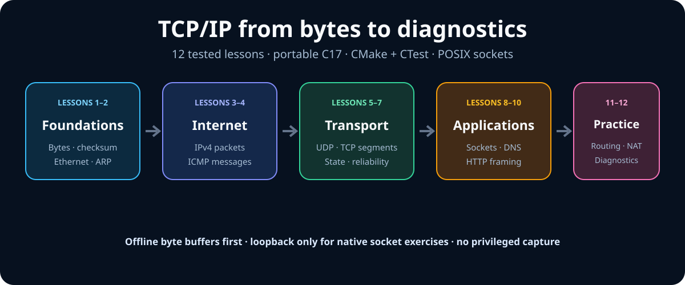
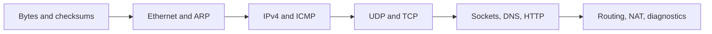

<!-- COURSE_COMPONENT:course-hero START -->
# TCP/IP Course in C17

Learn TCP/IP by reading bytes, modeling protocol state, and writing small portable C17 programs. The 12 portable core lessons move upward through the stack—from representation and local links to IPv4, transport, applications, routing, and integrated diagnostics. Four optional Linux implementation labs then connect those models to pinned kernel interfaces and source boundaries. C is the course language; Python 3.14, uv, MkDocs Material, pytest, and Ruff exist only to build and validate the documentation and repository contracts.

[Read the course site](https://lhmily.github.io/tcp-ip-course/) · [lhmily home](https://lhmily.github.io/) · [Source](https://github.com/lhmily/tcp-ip-course)
<!-- COURSE_COMPONENT:course-hero END -->





## What you will build

Each lesson contains the same six-file learning contract: an illustrated `README.md`, public declarations in `lesson.h`, a starter `exercise.c`, a reference `solution.c`, native `test.c`, and a local `CMakeLists.txt`. You will practice explicit byte decoding rather than mapping wire data onto C structs, and you will make bounds, ownership, state transitions, and failure behavior visible.

**What to notice:** the curriculum starts with deterministic byte buffers before it introduces sockets. This keeps protocol reasoning repeatable and separates parsing correctness from operating-system behavior.

| Layer or concern | Lessons | Main practice |
| --- | ---: | --- |
| Foundations | 1–2 | Byte order, checksums, Ethernet, ARP |
| Internet layer | 3–4 | IPv4 validation and ICMP semantics |
| Transport | 5–7 | UDP, TCP segments, state, reliability |
| Applications | 8–10 | POSIX streams, DNS, HTTP framing |
| Networks in practice | 11–12 | Routing, NAT, offline diagnostics |

<!-- COURSE_COMPONENT:course-prerequisites START -->
## Requirements

- A C17 compiler (Clang or GCC)
- CMake 3.25 or newer and CTest
- Linux or macOS with POSIX APIs for the socket lessons
- Git

Windows is not a supported native target for the POSIX socket exercises. A Linux environment such as WSL can be used instead. Python is not required to complete the C lessons; it is required only for maintainers who run repository and documentation tooling.

By the end of the course, you will be able to decode protocol bytes without mapping wire data onto C structs, model bounds and ownership explicitly, and compose parsers and local socket exercises into deterministic diagnostics.
<!-- COURSE_COMPONENT:course-prerequisites END -->

## Learner workflow

Configure and compile the starter implementations with the checked-in preset:

```sh
cmake --preset student
cmake --build --preset student
ctest --preset student
```

A starter may intentionally fail behavioral tests until its exercise is complete, but it must compile cleanly. To run the completed reference implementations:

```sh
cmake --preset reference
cmake --build --preset reference
ctest --preset reference
```

Use the sanitizer preset on systems with Clang:

```sh
cmake --preset sanitize
cmake --build --preset sanitize
ctest --preset sanitize
```

<!-- COURSE_COMPONENT:course-safety START -->
## Safety and network boundaries

The course is designed for safe, deterministic local study. Packet lessons operate on in-memory fixtures. Socket lessons bind only to loopback, use operating-system-assigned ephemeral ports, and communicate within one test process or machine. Exercises do not require internet access, elevated privileges, packet capture, raw or packet sockets, process execution, wildcard listeners, TUN/TAP devices, network namespaces, `fork`/`clone`, or traffic sent to third-party hosts. Do not adapt examples to inspect or contact systems you do not own or have explicit permission to test.

A deliberate non-goal is production networking software. The examples teach protocol representation, invariants, and defensive C techniques; they omit production concerns such as TLS, authentication, event-loop scale, adversarial deployment hardening, and broad platform abstraction.
<!-- COURSE_COMPONENT:course-safety END -->

<!-- COURSE_COMPONENT:core-curriculum START -->
## Curriculum

### Foundations

1. [Bytes, Addressing, and Checksums](lessons/01_bytes_addressing_checksum/README.md) — integer representation, byte order, bounds, addresses, and one's-complement checksums.
2. [Ethernet and ARP](lessons/02_ethernet_arp/README.md) — local-link framing, MAC addresses, EtherTypes, and address resolution.

### Internet layer

3. [IPv4 Packets](lessons/03_ipv4_packets/README.md) — header parsing, total length, fragmentation, TTL, and validation.
4. [ICMP](lessons/04_icmp/README.md) — echo messages, error reporting, quoted packets, and checksum handling.

### Transport

5. [UDP](lessons/05_udp/README.md) — datagram framing, pseudo-headers, ports, checksums, and loss semantics.
6. [TCP Segments](lessons/06_tcp_segments/README.md) — flags, sequence numbers, options, windows, and segment checksums.
7. [TCP State and Reliability](lessons/07_tcp_state_reliability/README.md) — state transitions, acknowledgments, retransmission, flow control, and shutdown.

### Applications

8. [Stream Sockets](lessons/08_stream_sockets/README.md) — POSIX socket lifecycle, partial I/O, loopback, and stream framing.
9. [DNS](lessons/09_dns/README.md) — names, compression pointers, questions, and resource records.
10. [HTTP](lessons/10_http/README.md) — request and response parsing, limits, body framing, and persistent streams.

### Networks in practice

11. [Routing and NAT](lessons/11_routing_nat/README.md) — longest-prefix match, forwarding decisions, mappings, and expiry.
12. [Diagnostics and Integration](lessons/12_diagnostics_integration/README.md) — composing parsers and explaining failures across layers from offline fixtures.
<!-- COURSE_COMPONENT:core-curriculum END -->

## Optional Linux implementation track

The portable core above remains complete and unchanged on Linux and macOS. Linux learners may continue with the optional, unprivileged labs shown in the track cards.

On Linux, build them with `linux-student`, `linux-reference`, or `linux-sanitize`. They require ordinary Linux UAPI headers but no root access, network namespaces, TUN/TAP devices, raw sockets, packet capture, or external network access. See the [Linux track overview](linux_labs/README.md) for exact commands and prerequisites.

The Linux kernel is GPL-2.0-only. This MIT-licensed course links to pinned Linux v6.6 sources for provenance and explanation; it does not copy kernel code or vendor source snapshots. UAPI headers are user/kernel contracts, while linked internal files are implementation references rather than stable application APIs.

## Repository tooling

Maintainers can install the locked documentation environment and run its checks:

```sh
uv sync --locked --dev
uv run pytest tests/test_repository_contract.py tests/test_documentation.py
uv run ruff check .
uv run ruff format --check .
uv run python scripts/generate_branding_assets.py --check
uv run python scripts/generate_documentation_assets.py --check
uv run python scripts/build_site.py
uv run mkdocs build --strict
```

See [CONTRIBUTING.md](CONTRIBUTING.md) before proposing a lesson change. The project is available under the [MIT License](LICENSE).
