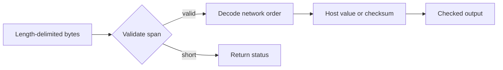

# Lesson 01: Bytes, addressing, and checksums

## Learning objectives

By the end of this lesson, you can decode and encode a 16-bit network-order integer without depending on host byte order, parse a length-delimited IPv4 address, decide whether an address belongs to a prefix, and compute the 16-bit Internet checksum. You will also practice an API discipline used throughout the course: every buffer has an explicit size, every result uses a checked output parameter, and a failed operation leaves a predictable result.

## Prerequisites

You should know C17 integer types, arrays, pointers, `size_t`, loops, and basic bitwise operations. Familiarity with binary and hexadecimal notation helps. You do not need socket programming experience. The examples assume an octet is represented by `uint8_t` and use fixed-width constants where useful.

## Mental model

A packet is a sequence of octets, not a native C structure. The byte sequence defines meaning; the machine's alignment and byte order do not. Read a field by checking its span first and combining individual octets. Write a field only after proving the full destination span exists. A prefix selects leading address bits, while the checksum treats adjacent octets as big-endian 16-bit words.



**What to notice:** validation precedes every indexed access, so malformed input cannot turn into an out-of-bounds read.

## Wire format or API

| API | Input interpretation | Successful output |
|---|---|---|
| `tcpip_l01_read_be16` | Two octets at `offset` | Host `uint16_t` |
| `tcpip_l01_write_be16` | Host `uint16_t` | Two network-order octets |
| `tcpip_l01_parse_ipv4(text, text_len, out_address, out_address_capacity)` | Exactly `text_len` characters and an explicitly sized output | Four copied address octets |
| `tcpip_l01_prefix_contains(address, address_length, network, network_length, prefix_length, out_contains)` | Two explicitly sized IPv4 addresses and `/0` through `/32` | Membership boolean |
| `tcpip_l01_checksum16` | Arbitrary byte span | One's-complement checksum |

Text is not required to be NUL-terminated. The parser reports `CAPACITY` unless `out_address_capacity` is at least four, and prefix matching reports `TRUNCATED` unless both address lengths are at least four. Empty checksum input is valid and produces `0xffff`; a `NULL` input is accepted only when its length is zero.

## Algorithm and state transitions

For a big-endian word, shift the first octet left by eight and OR the second octet. IPv4 parsing advances through four decimal components, rejecting missing digits, values above 255, extra components, and trailing characters. It writes into a temporary address and copies only after the complete grammar succeeds.

Prefix matching compares each complete prefix octet, then applies a high-bit mask to any remaining bits. `/0` compares no bits and therefore contains every address; `/32` compares all bits. The checksum adds big-endian words into a wider accumulator, places an odd final octet in the high half of a word, folds end-around carries, and complements the result.

## Worked C example

```c
uint8_t bytes[] = {0x12, 0x34};
uint16_t value = 0;
uint16_t checksum = 0;

if (tcpip_l01_read_be16(bytes, sizeof(bytes), 0, &value) != TCPIP_L01_OK) {
  return 1;
}
if (tcpip_l01_checksum16(bytes, sizeof(bytes), &checksum) != TCPIP_L01_OK) {
  return 1;
}
/* value is 0x1234; checksum is 0xedcb. */
```

The input remains const, and both outputs have defined values even if validation fails.

## Exercise

Complete each `TODO(lesson 01)` in `exercise.c`. Preserve validation and output initialization. For the parser, use a four-octet temporary so a late syntax error cannot expose a partially parsed address. For writes, do not change either destination octet until capacity has been established. Avoid library conversion functions that depend on NUL termination or accept syntax beyond this lesson's grammar.

## Test contract and invariants

The test executable links either `exercise.c` or `solution.c`, selected by `TCPIP_USE_SOLUTIONS`. It checks exact big-endian values, too-short reads, offsets beyond the span including `SIZE_MAX`, capacity failures with unchanged destination bytes, short IPv4 output and input arrays, valid and malformed IPv4 text, prefix boundaries `/0` and `/32`, a differing `/25` bit, and empty, even-length, and odd-length checksums. In student mode, unresolved functions return `TCPIP_L01_TODO`, causing a nonzero test result. The solution must pass every deterministic fixture.

## Common mistakes

Do not cast a byte pointer to `uint16_t *`: that can violate alignment and aliasing rules and still gives host-dependent byte order. Do not test `offset + 2 > length`, because addition may wrap; test `offset > length` and then the remaining length. Do not shift an eight-bit value before promoting it. A checksum's odd final byte is the high byte, not the low byte. A prefix mask uses the most significant bits first.

## Safety and network boundaries

This lesson performs pure in-memory transformations. It uses no network, raw sockets, capture, or external commands. It allocates no heap memory and owns no mutable global state. An explicit non-goal is sending packets or validating whether an address is reachable. The code demonstrates bounded parsing only; it is not an authorization boundary and should not be treated as a complete defense for an unrelated protocol.

## Further experiments

Add tests for prefixes `/1`, `/7`, `/8`, `/9`, `/24`, and `/31`. Verify the checksum by inserting it into a sample header and checking that recomputing over the complete header yields zero. Explore a strict parser policy that rejects leading zeroes, but document that policy and update fixtures rather than silently changing accepted syntax. Try compiling on a machine with different native byte order; the results should remain identical.

## Summary

Network formats belong to bytes, not C object layouts. Bounds-first decoding, temporary outputs, explicit big-endian operations, exact text grammars, leading-bit prefix masks, and one's-complement carry folding form a small toolkit that later packet lessons reuse. The status-returning APIs make normal malformed input distinguishable from programmer errors while keeping all outputs deterministic.
