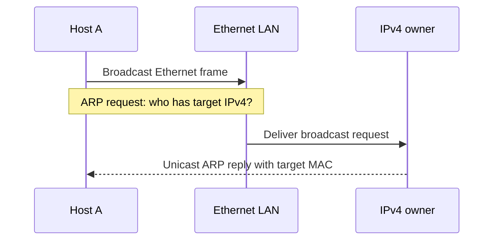

# Lesson 02: Ethernet and ARP

## Learning objectives

By the end of this lesson, you can parse an Ethernet II header, parse the Ethernet/IPv4 form of ARP, and construct a complete broadcast ARP request. You will distinguish protocol values from their on-wire octets, copy address fields into host-value structures, represent payloads with offsets and lengths, and reject incompatible ARP address widths before copying their fields. You will also preserve destination buffers when construction cannot succeed.

## Prerequisites

Complete lesson 01 or be comfortable with explicit big-endian 16-bit reads and writes. You should understand arrays, `memcpy`, fixed-width integer types, structs as ordinary host-side values, and checked buffer capacities. No familiarity with operating-system network interfaces is required.

## Mental model

An Ethernet frame is an envelope. Its fixed 14-octet header names a destination, a source, and the protocol carried in the remaining span. When EtherType is `0x0806`, that payload may be ARP. ARP then describes its own hardware and protocol address families and widths. The parser must validate those descriptors before assuming the familiar 6-octet MAC and 4-octet IPv4 layout.



**What to notice:** the request's Ethernet destination is broadcast, while its ARP target hardware address is six zero octets because that is the value being discovered.

## Wire format or API

| Layer/field | Octets | Request value or API result |
|---|---:|---|
| Ethernet destination | 6 | `ff:ff:ff:ff:ff:ff` |
| Ethernet source | 6 | Caller-provided sender MAC |
| EtherType | 2 | `0x0806` for ARP |
| Hardware/protocol types | 2 + 2 | Ethernet `1`, IPv4 `0x0800` |
| Address widths | 1 + 1 | MAC `6`, IPv4 `4` |
| Operation | 2 | Request `1` |
| Four ARP addresses | 6 + 4 + 6 + 4 | Sender values, zero target MAC, target IPv4 |

`tcpip_l02_parse_ethernet` copies header values and reports the payload as offset 14 plus the remaining length; it accepts only Ethernet II type values at or above `0x0600`, not IEEE 802.3 length fields. `tcpip_l02_parse_arp` accepts exactly the standard Ethernet/IPv4 layout and request or reply opcodes. `tcpip_l02_build_arp_request(sender_mac, sender_mac_length, sender_ip, sender_ip_length, target_ip, target_ip_length, out_frame, out_capacity, out_length)` creates exactly 42 octets: 14 Ethernet plus 28 ARP.

## Algorithm and state transitions

Ethernet parsing first zeroes the output, validates pointers, and requires at least 14 input octets. It copies both MAC addresses, decodes EtherType, and computes the payload span without retaining a borrowed pointer.

ARP parsing similarly requires 28 octets, decodes the fixed descriptor fields into a temporary structure, and checks hardware type, protocol type, both address widths, and opcode. Only then does it copy addresses and publish the temporary. Construction validates every pointer, the explicit MAC and IPv4 input lengths, and the full 42-octet capacity before any fixed-size copy. It assembles a zero-initialized local frame, fills constants and caller values, and copies to the destination once complete. Failure therefore cannot expose a partial frame.

## Worked C example

```c
uint8_t frame[TCPIP_L02_ARP_REQUEST_FRAME_LENGTH];
size_t frame_len = 0;
const uint8_t mac[6] = {0x02, 0x00, 0x5e, 0x10, 0x00, 0x00};
const uint8_t sender[4] = {192, 0, 2, 1};
const uint8_t target[4] = {192, 0, 2, 99};

if (tcpip_l02_build_arp_request(
        mac, sizeof(mac), sender, sizeof(sender), target, sizeof(target),
        frame, sizeof(frame), &frame_len) != TCPIP_L02_OK) {
  return 1;
}
/* frame_len is exactly 42. */
```

This constructs bytes only; it does not transmit them.

## Exercise

Complete the three `TODO(lesson 02)` regions in `exercise.c`. Use byte-wise big-endian helpers rather than unaligned casts. Keep parsing outputs zeroed unless the entire operation succeeds. Record an Ethernet payload with `payload_offset` and `payload_length`; do not store a pointer into caller memory. Build into a local 42-octet temporary and copy only after all validation and construction succeed.

## Test contract and invariants

The deterministic fixture is a broadcast request from `02:00:5e:10:00:00`, sender IPv4 `192.0.2.1`, for `192.0.2.99`. Tests compare all 42 octets, parse the built representation back into copied host values, and verify payload offset and length. Negative cases cover truncated Ethernet and ARP input, an IEEE 802.3 length field, wrong ARP hardware/protocol types and address widths, unsupported opcodes, short builder inputs, and one-octet-short output capacity. Parse failures zero complete output structures, and builder failures leave destination bytes unchanged with output length zero. Student mode returns `TCPIP_L02_TODO` for otherwise valid work and therefore exits nonzero; solution mode passes.

## Common mistakes

Do not include Ethernet preamble, start-frame delimiter, frame check sequence, or minimum-frame padding in this 42-octet API contract. Do not confuse EtherType `0x0806` with ARP's protocol type `0x0800`. Do not put the broadcast MAC into the ARP target field. Never overlay a packed struct on bytes: padding, alignment, aliases, and native byte order make that approach nonportable. Validate widths before calculating or copying variable address positions.

## Safety and network boundaries

This lesson has no network, raw sockets, capture, or external commands. It performs deterministic in-memory parsing and construction only, with no allocation and no mutable global state. An explicit non-goal is discovering a real neighbor, transmitting a frame, poisoning an ARP cache, or monitoring traffic. Generated bytes are educational fixtures; operating-system privileges and live-network behavior are outside the course boundary here.

## Further experiments

Construct an ARP reply by changing the operation and address roles in a separate API. Add trailing payload bytes and confirm Ethernet payload length grows while ARP consumes only its defined 28-octet packet. Test a valid opcode encoded with a nonzero high byte to reinforce network order. Design a generalized ARP parser that reports raw address spans for other families, then compare its more flexible contract with this lesson's intentionally strict copied-value model.

## Summary

Ethernet and ARP demonstrate layered parsing: first establish an outer payload span, then validate the inner format before interpreting addresses. Host-value structs copy stable fields rather than borrowing storage. Exact constants, explicit network-order operations, initialized failures, and atomic construction make the implementation portable and testable while keeping packet bytes separate from live networking.
