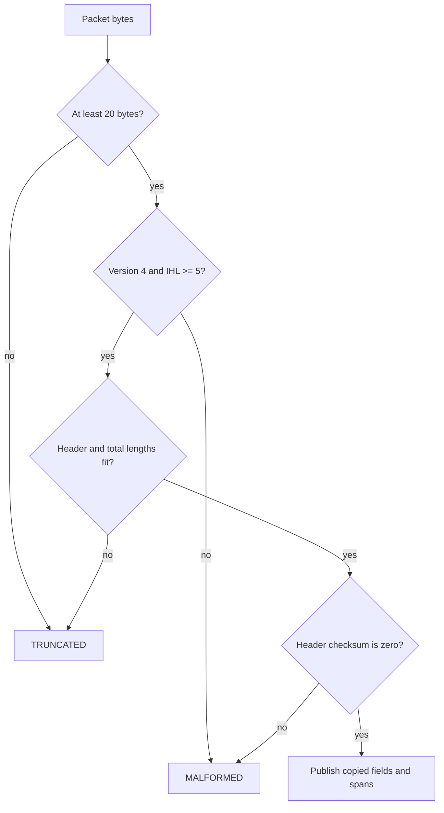

# Lesson 03: IPv4 packets

## Learning objectives

By the end of this lesson, you can decode an IPv4 header from a bounded byte span, derive its variable header and payload ranges, verify the header checksum including options, and build a complete header without relying on machine layout. You can also model a router's TTL step by decrementing the field and repairing the checksum while preserving the packet on failure. The larger goal is to treat every field as untrusted input until its prerequisite lengths and invariants have been checked.

## Prerequisites

You should understand fixed-width C17 integers, `size_t`, arrays, `const`, shifts, and network-order 16-bit values. Lesson 01's one's-complement arithmetic is helpful, but this implementation is self-contained and does not link another lesson API. Familiarity with the terms datagram, payload, and protocol number is useful. No socket programming knowledge is required.

## Mental model

An IPv4 packet begins with a header whose size is encoded in 32-bit words by IHL. Therefore even the payload offset is not known until the first byte is validated. The total-length field bounds the complete IPv4 packet; a containing capture buffer may be longer. Parse from the outside inward, and publish a result only after every check succeeds.



**What to notice:** the checksum covers the variable-length header, including options, but excludes the payload.

## Wire format or API

| Field or API | Width or role | Lesson rule |
|---|---:|---|
| Version + IHL | 1 octet | Version is 4; IHL is at least 5 words |
| Total length | 2 octets | At least the header length and no greater than available bytes |
| Identification | 2 octets | Copied as a host-order value |
| Flags + fragment offset | 2 octets | Preserved as one host-order value; reserved flag rejected by parser and builder |
| TTL / protocol | 1 octet each | Copied; TTL must exceed one before decrement |
| Header checksum | 2 octets | One's-complement verification over all header octets |
| Addresses | 4 octets each | Copied into the parsed result |
| `tcpip_l03_build_header` | builder | Produces a header-only packet, so total length equals header length |

Options are zero to forty octets and must be a multiple of four because IHL counts complete 32-bit words. The parser reports option and payload spans as offsets and lengths; it does not expose borrowed pointers.

## Algorithm and state transitions

First require the fixed 20-octet prefix. Split byte zero into version and IHL, multiply IHL by four, and prove that many bytes are available. Decode total length and flags only after their octets are known to exist, rejecting the reserved high flag bit. Reject a total shorter than the header and report truncation when the declared packet extends beyond the supplied span. Compute the one's-complement checksum over exactly the header length; a valid stored checksum makes the result zero.

The builder validates the options contract and full capacity before writing. It assembles into a 60-octet local array, leaves the checksum field zero, computes the checksum, inserts it, and performs one final copy. TTL decrement first parses the packet. If TTL is zero or one, it returns `MALFORMED` unchanged. Otherwise it changes TTL, clears the checksum field, and recomputes the header checksum.

## Worked C example

```c
uint8_t header[60];
size_t header_length = 0;
tcpip_l03_ipv4_header_fields fields = {0};

fields.identification = 0x1234;
fields.flags_fragment = 0x4000;
fields.ttl = 64;
fields.protocol = 17;
fields.source[0] = 192; fields.source[2] = 2; fields.source[3] = 1;
fields.destination[0] = 198; fields.destination[1] = 51;
fields.destination[2] = 100; fields.destination[3] = 2;

if (tcpip_l03_build_header(&fields, header, sizeof(header),
                           &header_length) != TCPIP_L03_OK) {
  return 1;
}
```

This creates a 20-octet, checksummed, header-only IPv4 packet. A caller that needs payload must define how total length is represented; this deliberately narrow builder does not silently promise payload space.

## Exercise

Complete each `TODO(lesson 03)` in `exercise.c`. Use explicit octet operations rather than structure overlays. In the parser, fill a local `tcpip_l03_ipv4_packet` and assign it only after successful validation. In the builder, validate option pointer, length, alignment, reserved flag, and capacity before modifying the destination. For TTL, call or reproduce the same complete validation before changing any packet byte.

## Test contract and invariants

The deterministic tests parse a base header with payload and an options-bearing fragmented packet, while intentionally performing no fragment reassembly. They distinguish malformed declarations from unavailable bytes, reject the reserved flag, verify that payload corruption does not affect the header checksum, reject header corruption, and compare complete zeroed parse outputs after every failure. Exact builders must match known checksum fixtures. Capacity and malformed-input failures leave destination bytes untouched and output length zero. TTL decrement changes exactly TTL and checksum, produces a parseable packet, and leaves expired or invalid input unchanged. Student mode detects `TCPIP_L03_TODO` and exits nonzero; solution mode passes.

## Common mistakes

Do not cast packet bytes to a C structure: padding, alignment, aliasing, and host byte order make that unsafe. Do not assume IHL is five. Do not checksum the payload or only the fixed prefix when options exist. Do not classify a declared total length smaller than the header as truncation; all bytes may be present, but the declaration is malformed. Do not mutate TTL before validating the old checksum and expiry rule. Remember that fragments remain ordinary parseable headers even though their payload cannot be interpreted as a complete higher-layer message.

## Safety and network boundaries

All operations are bounded, in-memory transformations. This lesson uses no network, raw sockets, capture, or external commands. It performs no allocation and owns no mutable globals. An explicit non-goal is fragment reassembly, packet transmission, route selection, or deciding whether source addresses are trustworthy. Parsing success establishes only this lesson's structural and checksum invariants; it is not an authentication or authorization decision.

## Linux implementation connection

The optional [Userspace Mini-Stack lab](../../linux_labs/03_userspace_mini_stack/README.md) connects this bounded parser to Linux's local I/O boundary by carrying authored IPv4 frames over a deterministic Unix datagram pair. In the pinned Linux v6.6 tree, [`include/uapi/linux/ip.h`](https://github.com/torvalds/linux/blob/v6.6/include/uapi/linux/ip.h) is UAPI: it describes types and constants visible across the user/kernel boundary, but it is not permission to overlay untrusted packet bytes on a C struct. By contrast, [`net/ipv4/ip_input.c`](https://github.com/torvalds/linux/blob/v6.6/net/ipv4/ip_input.c) is internal implementation source, not a stable application API. Read it to compare validation order and ownership, not to copy kernel code or depend on private symbols.

## Further experiments

Create valid headers at every IHL value from five through fifteen. Try unknown option octets and observe that this layer checks their bounded span rather than interpreting every option grammar. Compare full checksum recomputation with the RFC-style incremental TTL update, then prove they produce identical results. Build fixtures with the more-fragments flag and nonzero offset, but keep reassembly in a separately bounded component. Explore whether an application prefers strict rejection or explicit reporting of trailing containing bytes.

## Summary

IPv4 parsing is a sequence of dependent bounds checks: fixed prefix, version and IHL, variable header, total packet, then checksum. Explicit big-endian decoding and copied output fields avoid C layout hazards. A local header makes construction atomic, and validate-before-mutate makes TTL handling predictable. These habits scale to every later transport parser even though this lesson intentionally stops short of reassembly and networking.
