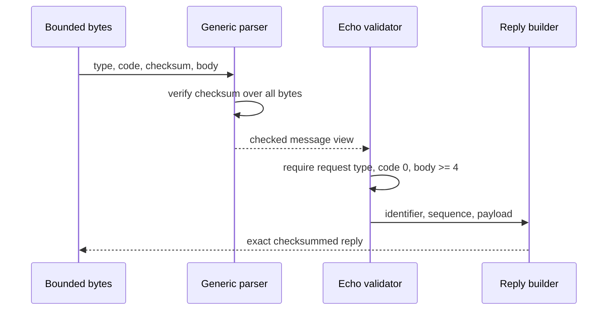

<!-- COURSE_COMPONENT:icmp-hero START -->
# Lesson 04: ICMP messages

| Lesson track | Structured fallback |
|---|---|
| Internet layer | Parse generic ICMP, build echo messages, and transform requests into replies safely. |
<!-- COURSE_COMPONENT:icmp-hero END -->

<!-- COURSE_COMPONENT:icmp-outcomes START -->
## Learning objectives

By the end of this lesson, you can parse a bounded ICMP message, verify its one's-complement checksum, describe its body without assuming a particular type, and construct exact echo request and reply messages. You can turn a valid echo request into a reply while preserving identifier, sequence number, and payload. You will also distinguish generic ICMP framing from type-specific semantics and maintain deterministic outputs and destination atomicity on every failure.

## Prerequisites

You should know C17 arrays, pointers, `size_t`, fixed-width integer types, network byte order, and the Internet checksum. Understanding that IPv4 carries ICMP as protocol 1 is helpful, but this lesson receives only ICMP message bytes and is self-contained. You do not need privileges, sockets, or a live host.
<!-- COURSE_COMPONENT:icmp-outcomes END -->

## Mental model

Every ICMP message has a four-octet common prefix: type, code, and checksum. Everything after that is a type-specific body. Echo messages refine the body into a four-octet identifier-and-sequence prefix followed by arbitrary payload. Generic parsing should not reject an error message merely because it is not echo; echo reply construction should be strict because it depends on echo-specific fields.



**What to notice:** checksum validity belongs to every ICMP type, while identifier and sequence interpretation belongs only to echo.

## Wire format or API

| Field or API | Width or role | Lesson rule |
|---|---:|---|
| Type | 1 octet | Parsed generically; builder accepts only 8 or 0 |
| Code | 1 octet | Parsed generically; echo builder always writes zero |
| Checksum | 2 octets | Covers the entire ICMP message, with odd final octet padded low with zero |
| Echo identifier | 2 octets | Network order at body offset zero |
| Echo sequence | 2 octets | Network order at body offset two |
| Echo payload | Remaining bytes | Preserved exactly, including odd-length payloads |
| `tcpip_l04_parse_message` | parser | Reports common fields and body offset/length |
| `tcpip_l04_make_echo_reply` | transformer | Accepts only a valid type-8, code-zero echo request |

An ICMP checksum does not use the IPv4 pseudo-header. A complete valid message produces a zero result when the same one's-complement computation includes its stored checksum.

<!-- COURSE_COMPONENT:icmp-fields START -->
## ICMP echo protocol fields

| Offset | Bytes | Field | Value | Meaning |
|---:|---:|---|---|---|
| 0 | 1 | Type | `8` | Echo request message |
| 1 | 1 | Code | `0` | Required code for an echo request |
| 2 | 2 | Checksum | `0xbbfd` | One's-complement checksum over the complete message |
| 4 | 2 | Identifier | `0x1234` | Echo identifier preserved in the reply |
| 6 | 2 | Sequence number | `7` | Echo sequence preserved in the reply |
| 8 | 5 | Payload | `abcde` | Odd-length payload covered by the ICMP checksum |
<!-- COURSE_COMPONENT:icmp-fields END -->

<!-- COURSE_COMPONENT:icmp-bytes START -->
## ICMP echo byte inspector

The 13-byte echo-request fixture, shown eight bytes per row, is:

```text
08 00 bb fd 12 34 00 07
61 62 63 64 65
```

The first four bytes are the common ICMP prefix, bytes 4–7 are the echo identifier and sequence number, and bytes 8–12 are the five-byte payload.
<!-- COURSE_COMPONENT:icmp-bytes END -->

<!-- COURSE_COMPONENT:icmp-checksum START -->
## ICMP message checksum

For checksum construction, set message bytes 2–3 to zero and checksum all 13 bytes:

```text
08 00 00 00 12 34 00 07 61 62 63 64 65
```

The expected one's-complement checksum is decimal `48125`, or hexadecimal `0xbbfd`. The odd final byte `0x65` occupies the high half of the final 16-bit checksum word; its low half is implicitly zero.
<!-- COURSE_COMPONENT:icmp-checksum END -->

## Algorithm and state transitions

The parser initializes its output, validates pointers, requires four octets, and computes the checksum over the complete supplied span. Only after a zero verification result does it publish type, code, checksum, and body bounds. It intentionally accepts valid non-echo error messages.

The echo builder validates the payload pointer/length pair, restricts type to request or reply, bounds the representable lesson message length, and checks destination capacity before writing. It copies payload with `memmove`, writes type and code zero, encodes identifier and sequence, calculates the checksum with a zero checksum field, and inserts the result. The reply function first performs generic parsing, then requires type 8, code zero, and at least four body octets. It passes the preserved fields and payload to the same builder.

## Worked C example

```c
static const uint8_t payload[] = {'p', 'i', 'n', 'g', '!'};
uint8_t message[32];
size_t message_length = 0;
tcpip_l04_message parsed;

if (tcpip_l04_build_echo(TCPIP_L04_ECHO_REQUEST, 0x1234, 7,
                         payload, sizeof(payload), message,
                         sizeof(message), &message_length) != TCPIP_L04_OK) {
  return 1;
}
if (tcpip_l04_parse_message(message, message_length, &parsed) != TCPIP_L04_OK) {
  return 1;
}
```

The five-octet payload exercises odd-byte checksum handling. Its last octet occupies the high half of the final checksum word.

<!-- COURSE_COMPONENT:icmp-contract START -->
## Exercise

Complete every `TODO(lesson 04)` in `exercise.c`. Keep the checksum helper private and self-contained. Publish parser output only after successful verification. In `build_echo`, validate all arguments and total capacity before touching destination bytes. In `make_echo_reply`, do not infer echo fields until generic validation succeeds and the type, code, and body length establish the echo grammar. Preserve payload bytes exactly, including when request and destination are the same buffer.

## Test contract and invariants

Tests compare exact request and reply fixtures containing an odd-length payload. They parse a valid destination-unreachable error fixture to prove generic behavior, then corrupt payload bytes to prove checksum rejection. Short input reports `TRUNCATED` and clears the parsed output. Invalid echo type, missing payload pointer, excessive length, and insufficient capacity receive distinct statuses. Reply creation rejects a reply, an error message, a checksummed echo message with nonzero code, corruption, and truncation. Failed builders leave destination bytes unchanged and output length zero. Student mode reports unresolved `TCPIP_L04_TODO` with a nonzero result; reference mode passes.
<!-- COURSE_COMPONENT:icmp-contract END -->

## Common mistakes

Do not checksum only the four-octet common header; ICMP covers its entire message. Do not add an IPv4 pseudo-header—that belongs to protocols such as UDP, not ICMPv4. For an odd byte count, shift the final octet into the high half of a 16-bit word. Do not treat every valid ICMP message as echo, and do not generate a reply to an echo reply. Validate code zero and enough echo-body bytes before reading identifier and sequence. Avoid unchecked `header + payload` arithmetic and partial destination writes.

<!-- COURSE_COMPONENT:icmp-safety START -->
## Safety and network boundaries

This lesson performs pure byte-array processing. It uses no network, raw sockets, capture, or external commands. It allocates no memory and maintains no mutable global state. An explicit non-goal is sending ping traffic, receiving operating-system errors, interpreting quoted IPv4 packets inside ICMP errors, rate limiting, or deciding whether a message is trustworthy. A valid checksum detects many accidental changes but is not cryptographic authentication.
<!-- COURSE_COMPONENT:icmp-safety END -->

## Further experiments

Try empty, one-octet, and maximum lesson-sized echo payloads. Verify that making a reply in the same buffer is safe. Add fixtures for time exceeded and parameter problem while keeping the generic parser independent of their body grammar. Write a separate bounded decoder for destination-unreachable bodies and quoted headers. Compare recomputing the full reply checksum with an incremental type-field update, then retain the approach whose proof and API contract are clearest.

## Summary

ICMP combines a small universal envelope with type-specific bodies. Validate the complete envelope and checksum first, then apply echo semantics only where required. Explicit byte-order operations, odd-byte checksum handling, checked capacities, initialized outputs, and reuse of one echo builder make requests and replies predictable. The result is educational packet logic with strict memory boundaries and no dependency on privileged networking.
