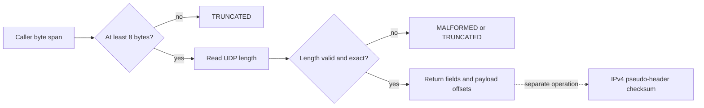

# Lesson 05: UDP datagrams

## Learning objectives

By the end of this lesson, you can decode a UDP header without relying on host layout, distinguish a truncated datagram from a malformed length field, and locate a payload using checked offsets. You can also build a datagram atomically, calculate the UDP checksum with an IPv4 pseudo-header, and explain why a generated checksum value of zero is transmitted as `0xffff`. The broader goal is to practice treating packet bytes as untrusted input while keeping parsing, construction, and validation APIs explicit.

## Prerequisites

You should be comfortable with fixed-width integer types, `size_t`, arrays, and byte-oriented big-endian encoding in C17. Review one's-complement addition and IPv4 addresses from earlier lessons. No packed structure or host byte-order shortcut is needed. The lesson is self-contained: its checksum implementation does not call another lesson's API.

## Mental model

UDP is a small envelope. Its eight-byte header says which application endpoints are involved, how many bytes belong to the datagram, and optionally authenticates accidental corruption. The length is part of the untrusted envelope, not permission to read that many bytes. First compare it with the supplied buffer length; only then derive the payload span.



The parser accepts a checksum field of zero. That is the documented IPv4 UDP policy for “checksum not supplied”; it is not the same as proving that a datagram is valid.

## Wire format or API

All multibyte wire fields are big-endian. The fixed header is exactly eight bytes.

| Bytes | Field or API value | Meaning |
|---:|---|---|
| 0–1 | `source_port` | Sender port; zero is representable |
| 2–3 | `destination_port` | Receiver port |
| 4–5 | `length` | Header plus payload, from 8 through 65535 |
| 6–7 | `checksum` | IPv4 UDP checksum, or zero when omitted on input |
| 8–end | `payload_offset`, `payload_length` | Checked span within the supplied datagram |
| API | `tcpip_l05_ipv4_checksum` | One's-complement result over pseudo-header and bytes |

`tcpip_l05_build_datagram` explicitly takes source and destination IPv4 byte spans. That design is intentional: a correct builder cannot generate the checksum from ports and payload alone. Each address length must be exactly four. The checksum function returns the raw computed result; therefore, a complete valid datagram normally produces zero.

## Algorithm and state transitions

Parsing initializes the result first, rejects null pointers, requires eight available bytes, and decodes the declared length. A value below eight is malformed. A declared value larger than the supplied span is truncated. This lesson uses strict framing, so trailing bytes also produce `MALFORMED` rather than being silently ignored.

Building validates every input and size before touching the destination. It rejects payloads larger than `65535 - 8`, checks destination capacity, writes the checksum field as zero, computes the pseudo-header checksum, and writes the result. If the computed generator value is zero, the builder writes `0xffff`, because an on-wire zero means “checksum omitted” for UDP over IPv4.

Checksum addition consumes 16-bit big-endian words. An odd final byte occupies the high half of a word with an implicit low zero. End-around carry is folded before complementing.

## Worked C example

```c
#include "lesson.h"

uint8_t source[4] = {192, 0, 2, 1};
uint8_t destination_ip[4] = {198, 51, 100, 2};
uint8_t payload[] = {'o', 'd', 'd'};
uint8_t wire[32];
size_t wire_length = 0;

tcpip_l05_status status = tcpip_l05_build_datagram(
    source, sizeof(source), destination_ip, sizeof(destination_ip),
    12000, 53, payload, sizeof(payload),
    wire, sizeof(wire), &wire_length);

if (status == TCPIP_L05_OK) {
  tcpip_l05_datagram view;
  status = tcpip_l05_parse_datagram(wire, wire_length, &view);
}
```

**What to notice:** addresses are byte spans, payload and destination have independent size information, and the builder reports the final byte count through an initialized out-parameter. Parsing returns offsets rather than borrowed interior pointers, making ownership of the original buffer obvious.

## Exercise

Complete the TODO sections in `exercise.c`. Implement explicit big-endian reads and writes; do not cast packet storage to a C structure. For parsing, preserve the distinction among invalid arguments, unavailable bytes, and internally inconsistent bytes. For building, perform the complete preflight before any destination write. Implement pseudo-header checksum accumulation locally and remember its protocol value is 17.

A useful workflow is to solve parsing first, then checksum calculation, then construction. Compare only public behavior with `solution.c`; avoid changing `lesson.h`, because tests compile either implementation against exactly that contract.

## Test contract and invariants

The deterministic test covers ports, the declared length, a five-byte odd payload, a zero input checksum, exact output bytes, corruption detection, short headers, oversized declared lengths, trailing data, insufficient capacity, and generator-zero mapping. In student mode, a remaining `TCPIP_L05_TODO` is an intentional nonzero test result. Reference mode must pass.

On every failure, structured outputs and output lengths are initialized. Capacity failure leaves the destination untouched. The largest representable UDP datagram is 65535 bytes total. The checksum routine rejects a pseudo-header length that cannot fit in its 16-bit UDP length contribution.

## Common mistakes

Do not read the length before confirming eight bytes exist. Do not subtract eight from an unchecked 16-bit value. Do not sum native `uint16_t` objects over packet memory: alignment and host byte order make that invalid. Do not forget the protocol word or UDP length in the pseudo-header. Do not treat a parser-accepted zero checksum as a successful checksum validation. Finally, do not write a header and only afterward discover that the destination is too small; that violates the no-partial-write contract.

## Safety and network boundaries

This lesson operates only on caller-provided memory. It performs no network access, opens no raw sockets, captures no traffic, and runs no external commands. Inputs may be copied from a documented fixture, but they must be treated as hostile bytes. It uses no allocation, global mutable state, packed structures, overlays, unaligned casts, or external libraries.

An explicit non-goal is sending or receiving UDP traffic. Socket APIs, DNS behavior, fragmentation, NAT, and application retry policy are outside this lesson. The code models datagram bytes only.

## Further experiments

Construct payloads of lengths zero, one, and two and observe odd-byte padding in the checksum. Change one pseudo-header address byte without changing the UDP bytes and verify that validation becomes nonzero. Build a 65535-byte datagram with a suitably sized static or caller-owned buffer, then attempt one additional payload byte. You can also compare strict framing with a hypothetical stream parser that reports consumed bytes rather than rejecting trailing input.

## Summary

UDP's compact format still demands disciplined boundaries. Validate the supplied span before trusting its length field, represent payloads as checked offsets, and generate the checksum from both IPv4 addresses plus the complete datagram. Bytewise C17 code is portable and reviewable, while preflight validation guarantees that failures do not leave partial packets behind.
