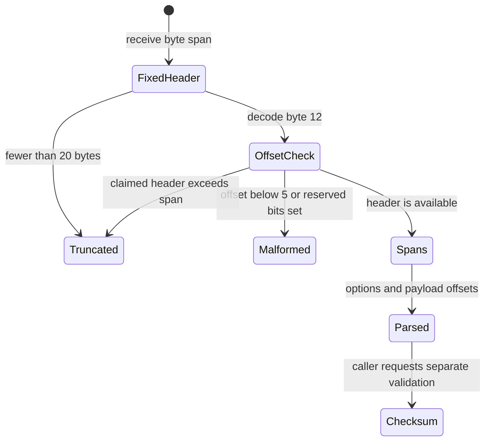

# Lesson 06: TCP segments

## Learning objectives

This lesson teaches you to parse and build a TCP segment using portable C17 byte operations. You will decode ports, sequence and acknowledgment numbers, the data offset, all nine current control flags including NS, the receive window, checksum, urgent pointer, options, and payload spans. You will validate variable header boundaries separately from checksum validity, generate a checksum with an IPv4 pseudo-header, and compare wrapping sequence numbers without an implementation-defined unsigned-to-signed conversion.

## Prerequisites

You should understand big-endian integers, checked `size_t` arithmetic, one's-complement checksum addition, and the role of an IPv4 pseudo-header. Familiarity with modular unsigned arithmetic helps with sequence numbers. The lesson does not depend on UDP or another lesson implementation; all helpers are private and self-contained.

## Mental model

A TCP segment has a fixed twenty-byte core followed by a variable options area and then application bytes. The four-bit data offset counts 32-bit words, so it is both a format field and a boundary claim. The parser must prove that claim against the supplied span before exposing options or payload offsets.



Sequence arithmetic is another modular boundary problem. A forward distance less than half the 32-bit space establishes “before.” Exactly half the space is ambiguous and this API returns false in both directions.

## Wire format or API

TCP multibyte values use network byte order. NS occupies the low bit of byte 12; the other eight flags occupy byte 13.

| Bytes | Field or API value | Meaning |
|---:|---|---|
| 0–1, 2–3 | source and destination ports | Endpoint identifiers |
| 4–7, 8–11 | sequence and acknowledgment | 32-bit serial values |
| 12 high nibble | `data_offset` | Header length in four-byte words |
| 12 low bit, 13 | `flags` | NS plus CWR, ECE, URG, ACK, PSH, RST, SYN, FIN |
| 14–19 | window, checksum, urgent pointer | Remaining fixed fields |
| 20–header end | options span | Zero through forty bytes |
| header end–segment end | payload span | Remaining supplied bytes |

`tcpip_l06_segment_fields` includes source and destination IPv4 byte spans because `tcpip_l06_build_segment` always generates a valid checksum. It also carries an options span. The straightforward builder requires options length from 0 through 40 and divisible by four; callers must supply any desired End-of-Option or No-Operation padding explicitly. Options and payload are separate input spans and must not overlap the destination span.

## Algorithm and state transitions

Parsing first zeros the output, validates pointers, and requires twenty bytes. It extracts the offset nibble and rejects values below five. This contract also rejects nonzero reserved bits while preserving NS. Multiplying a four-bit word count by four is bounded, after which the parser distinguishes a missing claimed header (`TRUNCATED`) from valid options and payload spans. Checksum correctness is not a parsing prerequisite and is checked through `tcpip_l06_ipv4_checksum`.

Building performs a full preflight: IPv4 spans are exactly four bytes, optional spans have valid pointer/length pairs, flags fit nine bits, options are aligned and bounded, total TCP length fits 16 bits, and destination capacity is sufficient. Only then does it copy bytes and encode the header. The checksum field is zero during generation.

The pseudo-header contributes both IPv4 addresses, a zero/protocol word containing protocol 6, and the TCP segment length. Odd segment bytes are padded conceptually, never by reading past the buffer.

For serial arithmetic, unsigned subtraction is defined modulo `2^32`. `seq_before(a, b)` tests whether `b - a` is nonzero and below `0x80000000`; `seq_distance(a, b)` simply returns that modular difference.

## Worked C example

```c
#include "lesson.h"

uint8_t client[4] = {192, 0, 2, 1};
uint8_t server[4] = {198, 51, 100, 2};
uint8_t options[4] = {2, 4, 5, 180}; /* MSS 1460 */
uint8_t wire[64];
size_t wire_length = 0;

tcpip_l06_segment_fields syn = {
    client, sizeof(client), server, sizeof(server),
    49152, 80, 0x12345678u, 0,
    TCPIP_L06_FLAG_SYN, 64240, 0,
    options, sizeof(options)};

tcpip_l06_status status = tcpip_l06_build_segment(
    &syn, NULL, 0, wire, sizeof(wire), &wire_length);
```

**What to notice:** the builder derives the data offset from the validated options length instead of accepting two potentially inconsistent values. It owns neither the input spans nor the destination. IPv4 addresses are explicit because TCP checksum generation depends on them even though they are not stored in the TCP segment.

## Exercise

Fill in each lesson-specific TODO in `exercise.c`. Start with byte readers and parser bounds. Add a checksum accumulator that folds end-around carry and handles a final odd byte. Then preflight and encode the builder. Finally, implement serial arithmetic using unsigned subtraction and a half-range comparison; do not cast a large `uint32_t` to `int32_t`.

Preserve the header API exactly. Every non-OK path with an out-parameter must leave it initialized, and a failed build must not alter any destination byte. Keep helpers private so all exported symbols retain the `tcpip_l06_` prefix.

## Test contract and invariants

Tests use an exact 28-byte SYN fixture with eight aligned option bytes and an exact odd-length data fixture carrying `hello`. They verify all decoded fields, NS plus ACK/PSH packing, options and payload spans, pseudo-header validation, corruption, invalid and unavailable offsets, reserved offset-byte bits, invalid option alignment, excessive flags, total-length limits, insufficient capacity, and sequence wrap behavior.

Student mode deliberately exits nonzero while parsing returns `TCPIP_L06_TODO`; the solution build passes. Parser failure leaves the result all zero. Builder failure leaves the reported length zero and destination unchanged. TCP's IPv4 pseudo-header length is limited to 65535 even though a `size_t` may be wider.

## Common mistakes

Do not interpret the data offset as bytes; multiply its word count by four. Do not accidentally discard NS when decoding flags. Do not accept an offset below five or expose options before checking the complete claimed header. Do not assume an options parser is required here: this lesson reports a checked raw options span. Do not include an already complemented checksum while generating a new one. Avoid signed casts for serial comparison because converting out-of-range unsigned values is implementation-defined. Also avoid writing fixed fields before checking option, payload, and destination sizes.

## Safety and network boundaries

The implementation transforms in-memory byte spans only. It performs no network access, opens no raw sockets, captures no traffic, and runs no external commands. There is no allocation, mutable global state, packed structure, bitfield, packet overlay, unaligned cast, undefined pointer arithmetic, or external library dependency.

An explicit non-goal is implementing a TCP connection. Handshake state, retransmission, congestion control, receive queues, timers, stream reassembly, and operating-system socket behavior are outside this segment-format lesson.

## Linux implementation connection

The optional [TCP_INFO lab](../../linux_labs/02_tcp_info/README.md) relates these segment fields to Linux without capturing traffic. In Linux v6.6, [`include/uapi/linux/tcp.h`](https://github.com/torvalds/linux/blob/v6.6/include/uapi/linux/tcp.h) is UAPI and documents user-visible TCP definitions; it does not make compiler bitfields a portable wire decoder. [`net/ipv4/tcp_input.c`](https://github.com/torvalds/linux/blob/v6.6/net/ipv4/tcp_input.c) is internal implementation source and may change independently of applications. Use the pinned sources for provenance and conceptual comparison only; the lab contains authored code and copies no GPL kernel implementation.

## Further experiments

Try zero, four, and forty option bytes and observe offsets 5, 6, and 15. Change only an IPv4 address and show that checksum validation fails despite identical TCP bytes. Explore pairs around `UINT32_MAX`, then test the deliberately ambiguous half-range pair. Build an odd payload to confirm conceptual zero padding. As an extension, write a separate, bounded iterator for option kinds without changing this parser's raw-span contract.

## Summary

TCP parsing combines fixed fields with a header boundary encoded inside untrusted input. Prove that boundary first, expose options and payload as offsets, and validate the pseudo-header checksum separately. A builder should derive redundant fields, preflight every length, and write only after success is guaranteed. Unsigned modular arithmetic provides portable sequence comparisons across wrap without relying on implementation-defined behavior.
