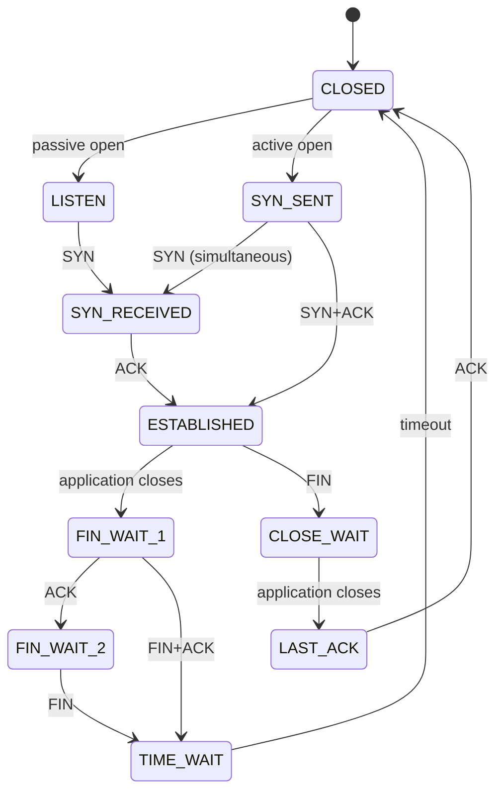

<!-- COURSE_COMPONENT:tcp-state-reliability-hero START -->
# Lesson 07: TCP state and reliability
<!-- COURSE_COMPONENT:tcp-state-reliability-hero END -->

<!-- COURSE_COMPONENT:tcp-state-reliability-prerequisites-outcomes START -->
## Learning objectives

After this lesson, you can model a focused subset of TCP connection states, reject impossible state/event pairs, and reassemble out-of-order bytes without dynamic allocation. You will also practice transactional C APIs: validate first, initialize out-parameters immediately, and mutate caller-owned state only after every byte has passed validation.

## Prerequisites

You should understand unsigned integers, arrays, pointers with explicit lengths, and the roles of SYN, ACK, and FIN. Familiarity with TCP sequence numbers helps, but the exercise explains the modulo arithmetic it uses. The code requires C17 and only the standard library.
<!-- COURSE_COMPONENT:tcp-state-reliability-prerequisites-outcomes END -->

## Mental model

TCP combines two related mechanisms. A finite-state machine records where a connection is in its lifetime. A byte-oriented sequence space records where payload belongs, independent of packet arrival order. This lesson deliberately keeps both models small enough to inspect.



## Wire format or API

There is no packet parser here. The public API accepts semantic events and payload bytes already extracted by a trusted caller. Every public symbol starts with `tcpip_l07_`. `tcpip_l07_reassembly_init` binds a context to separate caller-owned `data` and `present` arrays. For nonzero capacity, both arrays must be non-null and their complete `[pointer, pointer + capacity)` spans must not overlap. `push` accepts a sequence number and immutable input span; `read` copies the entire currently contiguous run into caller storage. Its complete output span `[out, out + out_capacity)` must not overlap either complete backing-array span, even if fewer bytes are currently readable.

| Result | Meaning |
|---|---|
| `TCPIP_L07_OK` | Operation committed |
| `TCPIP_L07_INVALID_ARGUMENT` | Pointer, enum, or context invariant was invalid |
| `TCPIP_L07_TRUNCATED` | Contiguous output exists but does not fit; nothing was consumed |
| `TCPIP_L07_MALFORMED` | Transition is impossible or overlapping bytes conflict |
| `TCPIP_L07_CAPACITY` | Segment falls outside the fixed receive window |
| `TCPIP_L07_TODO` | Starter implementation still needs work |

## Algorithm and state transitions

For transitions, validate both enum values, initialize `out_state`, then match the pair against the diagram. An unsupported pair is malformed rather than silently retaining the old state.

For reassembly, compute `offset` as unsigned 32-bit `seq - initial_seq`. Unsigned subtraction is defined modulo 2^32, so a segment can cross sequence value zero. Convert that result to `size_t`, then prove `offset <= capacity` and `len <= capacity - offset`; the subtraction form avoids addition overflow. Scan every overlapping byte before writing anything. Equal duplicate bytes are idempotent and do not increase `accepted`; unequal bytes reject the entire segment. A presence bitmap distinguishes a stored zero byte from a gap.

**What to notice:** validation and conflict detection precede mutation. A malformed overlap, capacity failure, or short read cannot leave half of an operation committed.

## Worked C example

```c
uint8_t bytes[8];
uint8_t present[8];
tcpip_l07_reassembly rx;
size_t accepted = 0;
size_t produced = 0;
uint8_t output[8];

if (tcpip_l07_reassembly_init(&rx, UINT32_MAX - 1U,
                              bytes, present, sizeof(bytes)) == TCPIP_L07_OK) {
  const uint8_t tail[] = {'c', 'd'};
  const uint8_t head[] = {'a', 'b'};
  tcpip_l07_reassembly_push(&rx, 0U, tail, sizeof(tail), &accepted);
  tcpip_l07_reassembly_push(&rx, UINT32_MAX - 1U,
                            head, sizeof(head), &accepted);
  tcpip_l07_reassembly_read(&rx, output, sizeof(output), &produced);
}
```

The first push lands at offset two despite the wrap. Reading waits until the second push fills offsets zero and one, then produces `abcd`.

<!-- COURSE_COMPONENT:tcp-state-reliability-exercise-test START -->
## Exercise

Complete `exercise.c` by implementing the transition table and the two-phase reassembly operations. Preserve the starter’s validation and output initialization. Do not allocate memory, enlarge the receive window, or partially write before checking a whole operation. Use `solution.c` only after reasoning through the invariants yourself.

## Test contract and invariants

The deterministic test checks every documented transition and every other valid state/event pair as malformed. It verifies invalid enums and output pointers, out-of-order insertion, wrap-around offsets, duplicate idempotence, conflicting-overlap rollback, capacity rollback, atomic truncation, zero-capacity contexts, backing-array overlap rejection, output alias rejection, and initialized outputs on errors. The starter returns `TCPIP_L07_TODO`, so the same test fails predictably; selecting reference solutions makes it pass.

At all times, `read_offset <= capacity`; each nonzero presence byte means the corresponding data byte is initialized; and accepted counts only bytes whose bitmap entries changed from absent to present.
<!-- COURSE_COMPONENT:tcp-state-reliability-exercise-test END -->

## Common mistakes

Do not compare sequence numbers with ordinary signed arithmetic, add `offset + len` before proving it cannot overflow, treat duplicate retransmissions as new data, or overwrite a matching prefix before discovering a conflicting suffix. Do not use a zero payload byte as a presence marker. Do not advance the read cursor after returning `TRUNCATED`. Do not compare unrelated pointers directly when checking for array overlap; convert to integer addresses and prove address-plus-length cannot overflow first.

<!-- COURSE_COMPONENT:tcp-state-reliability-safety START -->
## Safety and network boundaries

All buffers have explicit capacities, inputs are `const`, and outputs are caller-owned. Null pointers are accepted only for zero-length storage where documented by behavior. Backing arrays and read outputs are validated with overflow-safe address ranges before mutation so aliasing cannot corrupt unread data or presence state. No allocation or global mutable state is used. This is an offline model: external network access, raw packet capture, and elevated privileges are prohibited. Feed only deterministic byte arrays from the test process.

An explicit non-goal is implementing a production TCP stack. Congestion control, retransmission timers, checksums, receive-window sliding, urgent data, reset handling, and the complete RFC state machine are intentionally omitted.
<!-- COURSE_COMPONENT:tcp-state-reliability-safety END -->

## Linux implementation connection

The optional [TCP_INFO lab](../../linux_labs/02_tcp_info/README.md) compares this small state model with safe information Linux exposes to applications. [`include/uapi/linux/inet_diag.h`](https://github.com/torvalds/linux/blob/v6.6/include/uapi/linux/inet_diag.h) in the pinned v6.6 tree is a UAPI contract for diagnostics, whereas [`net/ipv4/tcp_input.c`](https://github.com/torvalds/linux/blob/v6.6/net/ipv4/tcp_input.c) is internal TCP implementation source rather than an application interface. Neither replaces this lesson's explicit invariants. The lab treats those links as provenance and writes original explanatory code instead of copying GPL kernel source.

## Further experiments

Add a non-mutating query that reports the next contiguous length, then let callers size a read before committing it. Explore a sliding window that reuses consumed storage while preserving modulo sequence comparisons. Add property tests that permute non-conflicting segments and prove the final byte stream is order-independent.

## Summary

TCP reliability is easier to reason about when connection state and byte placement are explicit. A compact transition table rejects invalid lifecycle events, while a bounded presence bitmap supports out-of-order delivery and harmless retransmission. Checked lengths, initialized outputs, wrap-safe subtraction, and preflight-before-commit turn those ideas into a safe C17 interface.
