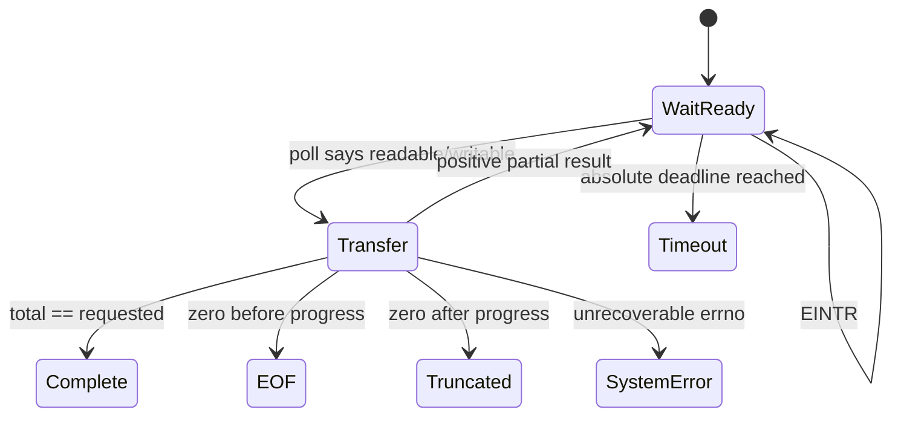

# Lesson 08: Stream sockets
## Learning objectives

By the end of this lesson, you can explain why TCP is a byte stream rather than a message transport, implement complete sends and exact receives despite partial system calls, impose an application-level frame boundary, and distinguish EOF, truncation, timeout, capacity, malformed input, and operating-system failure. You will also use `poll` with one `CLOCK_MONOTONIC` absolute deadline so repeated interruptions cannot silently extend a caller's timeout.

## Prerequisites

You should be comfortable with C17 arrays and pointers, explicit `size_t` lengths, fixed-width integers, file descriptors, byte order, and the lifecycle `socket` → `bind` → `listen` → `accept` → `close`. Lesson 7's TCP reliability model is useful background. The examples target Linux and macOS POSIX sockets.

## Mental model

A successful TCP connection is two ordered byte streams. A single `send` may write fewer bytes than requested; a single `recv` may return any positive prefix currently available. Neither call preserves the chunks used by its peer. Therefore application code must retain progress and recover its own boundaries.



**What to notice:** readiness is permission to try an operation, not a guarantee that the whole logical message can be transferred.

## Wire format or API

A frame is a four-byte unsigned payload length in network byte order followed by exactly that many payload bytes. Empty frames are valid.

| Offset | Size | Meaning | Validation |
|---:|---:|---|---|
| 0 | 4 bytes | Big-endian payload length | Must fit the caller's capacity |
| 4 | declared length | Opaque payload | Must arrive completely |

The public `tcpip_l08_` API exposes `send_all`, `recv_exact`, `send_frame`, `recv_frame`, and `serve_one`. Buffers always carry explicit lengths. `recv_frame` requires `out_len`, initializes it to zero before other validation, and writes the received size only on success. `serve_one` accepts one connection, receives one frame up to `TCPIP_L08_SERVER_FRAME_CAPACITY`, echoes it, closes the accepted descriptor, and leaves the listener open with its original file status flags restored.

## Algorithm and state transitions

First compute an absolute deadline from `CLOCK_MONOTONIC`; wall-clock changes must not alter elapsed-time behavior. Before each I/O attempt, subtract the current monotonic time and round the remaining interval up to milliseconds for `poll`. Retry `poll`, `send`, `recv`, and `accept` when interrupted by `EINTR`. `serve_one` temporarily enables `O_NONBLOCK` on the listener before waiting and accepting, so readiness races become `EAGAIN` retries against the same deadline rather than blocking accepts; it restores the listener's original flags before continuing. Advance the buffer offset only after a positive result. A zero-length read before any requested byte is `TCPIP_L08_EOF`; after partial progress it is `TCPIP_L08_TRUNCATED`. If the deadline expires, return `TCPIP_L08_TIMEOUT`. Other POSIX failures become `TCPIP_L08_SYSTEM`.

For framed receive, read the complete header first, decode it without alignment assumptions, compare the declared length with capacity, then read the payload. On `TCPIP_L08_CAPACITY`, payload bytes remain unread. This deterministic rule lets a caller decide whether to close the stream or deliberately discard a known number of bytes.

## Worked C example

```c
uint8_t reply[256];
size_t reply_len = 0;
tcpip_l08_status status;

status = tcpip_l08_send_frame(fd, request, request_len, 500);
if (status == TCPIP_L08_OK) {
  status = tcpip_l08_recv_frame(fd, reply, sizeof(reply), &reply_len, 500);
}
if (status == TCPIP_L08_OK) {
  consume_reply(reply, reply_len);
}
```

The caller owns all storage and chooses a bounded timeout for each complete framed operation. No terminating byte is implied; binary zeroes are ordinary payload.

## Exercise

Complete the TODO paths in `exercise.c` using the contract in `lesson.h`. Build internal helpers that accept a shared absolute deadline so a frame's header and payload do not each receive a fresh timeout. Validate every descriptor, buffer/length pair, timeout, capacity, and output pointer. Keep the provided output initialization. Handle partial progress and `EINTR`, and preserve the exact status distinctions.

## Test contract and invariants

The test first checks validation and output initialization. Local `socketpair` streams cover multiple back-to-back frames, oversized declarations whose payload remains available, clean EOF, partial-input truncation, and bounded receive timeout. The integration portion binds only `127.0.0.1` with port `0`, confirms the kernel-selected address with `getsockname`, calls `listen` before creating a pthread, fragments header and payload writes, validates the echoed frame, confirms the listener stays open with unchanged flags, closes every descriptor, joins every started thread, and checks that `serve_one` propagates a truncated request. On platforms where `size_t` can represent it, validation also passes a non-dereferenced fake length larger than `UINT32_MAX` and expects `MALFORMED`. All test waits are bounded; CTest also provides an outer timeout.

## Common mistakes

Do not assume one `send` matches one `recv`, restart the timeout after every partial operation, use `time(NULL)` for elapsed deadlines, cast a four-byte input directly to `uint32_t *`, or write `out_len` only on success. Do not confuse orderly EOF with a transient `EAGAIN`, ignore `SIGPIPE` behavior while sending, consume an oversized payload accidentally, close the caller's listening descriptor, or forget to join a server thread on an error path.

## Safety and network boundaries

This lesson performs no allocation and uses no global mutable state. It does not use raw sockets, external network access, subprocesses, shell commands, DNS, privileged ports, `INADDR_ANY`, or fixed ports. Tests communicate only over kernel-local socket pairs and a `127.0.0.1` listener assigned ephemeral port `0`, with bounded timeouts on Linux/macOS POSIX systems. Production hardening such as authentication, encryption, rate limiting, multi-client concurrency, and unbounded frame sizes is intentionally excluded.

An explicit non-goal is building a general-purpose or internet-facing echo daemon. The fixed-capacity, one-connection server exists only to make framing and lifecycle behavior observable and deterministic.

## Linux implementation connection

The optional [epoll Event Loop lab](../../linux_labs/01_epoll_event_loop/README.md) follows ordinary descriptors through Linux readiness and lifecycle boundaries. [`include/uapi/linux/socket.h`](https://github.com/torvalds/linux/blob/v6.6/include/uapi/linux/socket.h) is pinned v6.6 UAPI for the user/kernel contract. [`net/socket.c`](https://github.com/torvalds/linux/blob/v6.6/net/socket.c) is internal kernel implementation, not a stable API and not source to copy into this MIT-licensed course. The lab remains unprivileged and loopback-only while using these links to explain where partial I/O, readiness, and lifecycle behavior cross the boundary.

## Further experiments

Try shrinking socket send buffers to induce more partial writes, sending an empty frame, placing three frames in one write, or delaying each byte while remaining inside the same deadline. Add a discard helper for oversized frames and document how stream synchronization is restored. Compare level-triggered `poll` with nonblocking edge-triggered event loops, but retain the same framing state machine and status contract.

## Summary

TCP delivers ordered bytes, so applications must define and enforce message boundaries. Correct stream helpers validate explicit buffers and lengths, preserve partial progress, use monotonic absolute deadlines, retry interruptions, classify EOF precisely, and make capacity behavior predictable. Length-prefixed framing composes those mechanics into a reusable operation, while the loopback echo test demonstrates the contract without crossing the machine's network boundary.
