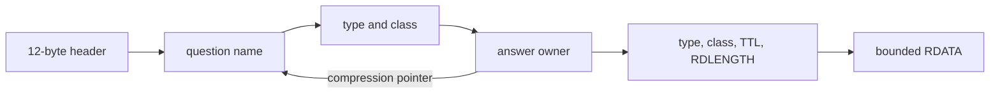

<!-- COURSE_COMPONENT:dns-hero START -->
# Lesson 09: DNS wire format

| Lesson track | Structured fallback |
|---|---|
| Applications | Encode DNS names, decode compression safely, build queries, and locate IN/A answers offline. |
<!-- COURSE_COMPONENT:dns-hero END -->

<!-- COURSE_COMPONENT:dns-outcomes START -->
## Learning objectives

After this lesson, you can encode a dotted domain name into DNS label form, decode a possibly compressed name without following pointer cycles forever, construct one deterministic query, and parse the fixed DNS header into host-order values. You will also walk question and answer sections to locate an IPv4 address record while preserving transaction-style output behavior: errors initialize metadata and never expose partially constructed bytes.

## Prerequisites

You should understand unsigned integer types, arrays, explicit byte lengths, and big-endian integer encoding. Familiarity with UDP is useful context, but this lesson neither opens a socket nor depends on a resolver library. The implementation uses C17 and the standard library only.
<!-- COURSE_COMPONENT:dns-outcomes END -->

## Mental model

A DNS message is a bounded byte tree with references. The twelve-byte header gives section counts. Each section then contains variable-length names and fixed fields. A name is a sequence of labels terminated by zero; inside a message, a two-byte compression pointer can replace the remaining suffix. That pointer makes decoding graph traversal rather than simple linear scanning.



## Wire format or API

All public symbols begin with `tcpip_l09_`. Text names are passed as `const char *` plus `name_len`; no terminating NUL is required, and an optional final dot denotes the root. Decoded names are dotted bytes followed by NUL. `written` excludes that NUL, while `next_offset` points after the name representation at the original location, even when decoding followed a pointer elsewhere.

| Field or result | Meaning |
|---|---|
| label length `0..63` | Number of following label bytes; zero terminates a name |
| top bits `11` | Remaining fourteen bits are a compression-pointer offset |
| `TCPIP_L09_OK` | Operation completed; its numeric value is zero |
| `TCPIP_L09_INVALID_ARGUMENT` | A required pointer or semantic input was invalid |
| `TCPIP_L09_TRUNCATED` | The supplied message ended before a declared field, or TC was set |
| `TCPIP_L09_MALFORMED` | Labels, pointers, flags, response code, or records violate this API’s contract |
| `TCPIP_L09_CAPACITY` | Caller output storage is too small; no partial output is committed |
| `TCPIP_L09_TODO` | Valid starter call reached code the learner must implement |

`tcpip_l09_parse_message` only decodes the fixed header. The returned ID, flags, counts, and `rcode` are host values, so callers can compare a response ID with their outstanding query ID directly. `tcpip_l09_first_a` accepts a response byte span and writes the first IN/A address and TTL. It intentionally has no expected-ID parameter: parse the header first and perform the transaction-ID check in the calling layer before accepting the answer.

## Algorithm and state transitions

Encoding first validates every label and computes the complete wire length. Only after proving the destination is large enough does it write label lengths, bytes, and the root terminator. Query construction similarly encodes into fixed local scratch space, computes the complete message size, then commits a header with ID, RD, QDCOUNT=1, QTYPE, and QCLASS=IN.

Decoding starts at `offset` and alternates among three states: read a label, finish at the zero byte, or follow a pointer. A 16,384-bit bitmap records pointer targets because DNS pointers have fourteen-bit offsets. Revisiting a target is a cycle and therefore malformed. A separate hop bound limits work even if future edits weaken that invariant. The decoder also tracks the expanded 255-byte wire-name limit and only copies a fully decoded NUL-terminated result to the caller.

Answer traversal decodes each question name, skips its four fixed bytes, then decodes each answer owner and preflights the ten-byte resource-record header plus declared RDATA. The first type A, class IN record must have exactly four RDATA bytes.

**What to notice:** compression changes where decoding reads next, but not where the enclosing parser resumes. `next_offset` is captured after the first pointer and remains independent of the pointer target.

## Worked C example

```c
uint8_t query[64];
size_t query_len = 0;
tcpip_l09_dns_header response_header;
uint8_t address[4];
uint32_t ttl = 0;

if (tcpip_l09_build_query(0x1234U, "example.com", 11U, 1U,
                          query, sizeof(query), &query_len) == TCPIP_L09_OK) {
  /* A transport may later provide response and response_len. */
  if (tcpip_l09_parse_message(response, response_len, &response_header) == TCPIP_L09_OK &&
      response_header.id == 0x1234U) {
    tcpip_l09_first_a(response, response_len, address, &ttl);
  }
}
```

The ID check belongs between header parsing and answer acceptance. The library does not keep outstanding-query state globally.

<!-- COURSE_COMPONENT:dns-contract START -->
## Exercise

Complete `exercise.c` without changing `lesson.h`. Implement name encoding and decoding, exact query construction, host-order header parsing, and bounded resource-record traversal. Preserve the starter’s argument checks and immediate output initialization. Do not allocate memory, cast message bytes to C structs or integer pointers, introduce global mutable state, or write part of a caller buffer before discovering a later error.

## Test contract and invariants

The deterministic tests compare the query byte for byte, including transaction ID, RD flag, counts, QTYPE, and IN class. They cover ordinary and trailing-dot names, root encoding, short destination buffers, empty and overlong labels, embedded zero bytes, compressed answer owners, `next_offset`, truncated labels and pointers, out-of-range pointers, direct and indirect cycles, reserved label prefixes, host-order header fields, a compressed A response, NXDOMAIN, TC, a query passed as a response, and truncated RDATA. Invalid calls must leave `written`, `next_offset`, address, TTL, or header initialized as documented. The starter reaches `TCPIP_L09_TODO`, so its test fails; the same test linked to `solution.c` passes.

A successful name is at most 255 bytes in expanded wire form, each label is at most 63 bytes, every cursor movement is proven against `message_len`, and every resource-record payload is bounded by its declared length and the containing message. No successful return exposes network-endian integer values.
<!-- COURSE_COMPONENT:dns-contract END -->

## Common mistakes

Do not call `strlen` when an explicit input length is supplied. Do not accept an interior empty label, forget the terminal root byte, or conflate `CAPACITY` with a truncated input message. Never resume an enclosing record at the end of a compression target. Do not permit reserved `01` or `10` label prefixes, trust section counts without checking each field, or assume a four-byte RDATA value is an A record without checking type and class. A pointer may refer anywhere within its fourteen-bit space, including forward, so monotonic-offset checks alone are not a complete cycle defense.

<!-- COURSE_COMPONENT:dns-safety START -->
## Safety and network boundaries

Every operation consumes explicit byte spans and caller-owned output capacities. The implementation uses no allocation, no global mutable state, and no wire-struct or unaligned integer casts. Scratch arrays have protocol-derived fixed bounds, and output operations preflight before committing. Deterministic fixtures make malformed inputs reproducible.

This lesson is strictly offline. External network access, operating-system resolver calls, raw packet capture, and elevated privileges are prohibited. Use only byte arrays constructed by the test process. An explicit non-goal is a production recursive or authoritative resolver: DNSSEC, EDNS, TCP fallback, caching, canonical-name chasing, internationalized names, search domains, and resolver policy are intentionally omitted.
<!-- COURSE_COMPONENT:dns-safety END -->

## Further experiments

Add AAAA extraction with a sixteen-byte caller buffer, then generalize record iteration without sacrificing bounds checks. Generate acyclic pointer chains near the hop limit and compare their expanded names. Add a caller-side helper that checks an expected transaction ID before dispatching records. Property-test encoder/decoder round trips over valid labels and verify that every one-byte truncation of a valid message is rejected safely.

## Summary

DNS turns simple names into a hostile-input parsing exercise: variable lengths, section counts, big-endian fields, and compression pointers all interact. A robust C17 design keeps byte spans explicit, decodes integers manually, separates compressed-read position from parser-resume position, bounds graph traversal with visited offsets and hops, and commits outputs only after validation. Those techniques apply far beyond DNS to any compact binary protocol with offsets or nested lengths.
