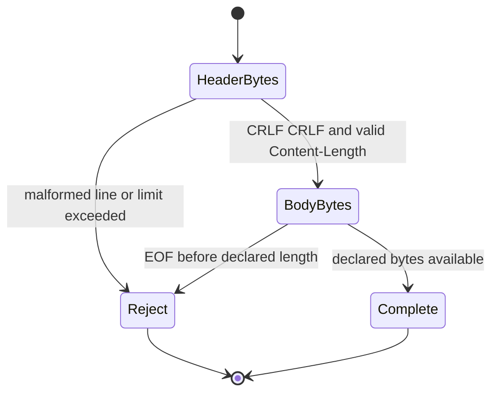

<!-- COURSE_COMPONENT:http-hero START -->
# Lesson 10: HTTP
<!-- COURSE_COMPONENT:http-hero END -->
<!-- COURSE_COMPONENT:http-prerequisites-outcomes START -->
## Learning objectives

By the end of this lesson, you can construct a small HTTP/1.1 request without allocation, parse a request or response into non-owning spans, and explain why message framing is separate from TCP reads. You will also practice deadline-based socket I/O with `poll`, recognize premature EOF, and reject ambiguous framing before application code sees it.

## Prerequisites

You should be comfortable with C17 arrays, pointer-plus-length slices, POSIX sockets, TCP byte streams, and the difference between a protocol error and a system-call error. Lessons on byte order, TCP connections, and bounded buffers are useful preparation. The code targets Linux and macOS POSIX environments.
<!-- COURSE_COMPONENT:http-prerequisites-outcomes END -->

## Mental model

TCP delivers an ordered stream, not HTTP records. One `recv` may return half a line, several headers, or a complete message plus bytes belonging to a later message. This lesson deliberately supports one message and uses `Content-Length` as its only body delimiter. Parsing therefore has two stages: find the `\r\n\r\n` header terminator within the header limit, then wait until exactly the declared body length is present.



The returned `tcpip_l10_message_view` borrows the caller's input buffer. Its method, target, version, reason, header names, header values, and body are spans; none is NUL-terminated or independently owned. Keep the buffer alive and unchanged while using the view.

## Wire format or API

The accepted subset uses an HTTP/1.1 request line or status line, CRLF-terminated headers, a blank CRLF line, and an optional body described by decimal `Content-Length`. At most 16 headers, 4096 header bytes, and 8192 body bytes are accepted.

| API | Role | Important output rule |
|---|---|---|
| `tcpip_l10_build_request` | Build a deterministic `POST` request | `written` starts at zero |
| `tcpip_l10_parse_message` | Create a borrowed message view | the view is zeroed before validation |
| `tcpip_l10_send_message` | Send the entire supplied span | `sent` reports progress |
| `tcpip_l10_recv_message` | Receive one framed message | `received` and the view are initialized |
| `tcpip_l10_serve_one` | Handle one request, then respond | sends a fixed `200 OK` with body `OK` |

Status zero, `TCPIP_L10_OK`, means success. `INVALID_ARGUMENT`, `TRUNCATED`, `MALFORMED`, `CAPACITY`, and starter-only `TODO` describe API or protocol outcomes. `EOF`, `TIMEOUT`, and `SYSTEM` distinguish socket outcomes. `TRUNCATED` means some message bytes arrived but EOF occurred before framing was complete; `EOF` means the peer closed before sending any bytes.

## Algorithm and state transitions

First, initialize every output. The parser searches only within the header bound for `\r\n\r\n`. It validates the start line, then walks each header line, splitting at the first colon and trimming optional whitespace around the value. Header names use token characters. A line beginning with space or tab is obsolete folding and is rejected. Any `Transfer-Encoding` is rejected because this subset does not implement chunking. Repeated `Content-Length` values are accepted only when numerically identical; invalid decimal syntax, overflow, or a value above the body bound fails.

After headers, compute `header_bytes + content_length` with overflow protection. Fewer bytes means `TRUNCATED`; enough bytes yields a body span and `message_length`. Network functions repeatedly call `poll` and then `send` or `recv`. They derive one absolute deadline from `CLOCK_MONOTONIC`, so retries and fragmented delivery cannot restart the timeout. `serve_one` shares one deadline across both receive and send phases.

<!-- COURSE_COMPONENT:http-timeline START -->
### HTTP stream framing timeline

| Order | Lane | Event | Detail |
|---:|---|---|---|
| 1 | Deadline | Share one deadline | `send_message`, `recv_message`, and `serve_one` preserve partial progress without refreshing the operation timeout. |
| 2 | Client | Fragment POST /demo | The client sends `POST /demo` with `Content-Length: 4` and body `ping` in two-byte chunks. |
| 3 | Parser | Find header terminator | Parsing waits for the `\r\n\r\n` boundary inside the header limit before trusting `Content-Length`. |
| 4 | Parser | Read Content-Length body | The four declared request body bytes must all arrive before the request view is complete. |
| 5 | Server | Send fixed 200 response | `serve_one` replies with `HTTP/1.1 200 OK`, `Content-Length: 2`, and body `OK`. |
| 6 | Server | Fragment response bytes | A separate receive fixture fragments a 200 response in three-byte writes while declaring `Content-Length: 5`. |
| 7 | Client | Assemble hello body | `recv_message` succeeds only after all five `Content-Length` bytes for `hello` are present. |
| 8 | Parser | Reject premature EOF | A response declaring `Content-Length: 4` but delivering only `ab` before close returns `TRUNCATED`. |
| 9 | Parser | Reject chunked coding | `Transfer-Encoding: chunked` is `MALFORMED` because chunked framing is a non-goal. |
| 10 | Parser | Keep TLS out of scope | TLS is not modeled; this lesson stays on plaintext bounded localhost streams. |
<!-- COURSE_COMPONENT:http-timeline END -->

## Worked C example

```c
uint8_t wire[256];
size_t written = 0;
const uint8_t path[] = "/echo";
const uint8_t body[] = "hi";

tcpip_l10_status status = tcpip_l10_build_request(
    path, sizeof(path) - 1,
    body, sizeof(body) - 1,
    wire, sizeof(wire), &written);
if (status != TCPIP_L10_OK) {
  /* Handle INVALID_ARGUMENT or CAPACITY. */
}

tcpip_l10_message_view view;
status = tcpip_l10_parse_message(wire, written, &view);
if (status == TCPIP_L10_OK) {
  /* view.body points into wire and has view.body.length bytes. */
}
```

**What to notice:** every textual value has an explicit length, the builder never appends an implicit NUL byte, and parsing performs no allocation. The output buffer owns all resulting view data.

<!-- COURSE_COMPONENT:http-exercise-test START -->
## Exercise

Complete `exercise.c` by following the public contract in `lesson.h`. Implement request construction first, then strict message parsing. Add the monotonic deadline helper, a polling helper, and loops that preserve partial progress across interrupted or short system calls. Finally, implement `serve_one`: receive exactly one request, require request syntax, and send this deterministic response: HTTP/1.1 status 200, `Content-Length: 2`, `Content-Type: text/plain`, `Connection: close`, and body `OK`.

Do not loosen validation to make a single test pass. In particular, preserve initialized outputs on every error path and never treat connection close as a successful body delimiter.

## Test contract and invariants

The same `test.c` links against the starter by default and the reference implementation when `TCPIP_USE_SOLUTIONS=ON`. The starter is expected to fail because valid operations return `TCPIP_L10_TODO`; the solution must pass. Tests cover exact request bytes, borrowed request and response views, invalid arguments, small buffers, truncated bodies, chunking, obsolete folding, conflicting and invalid lengths, excessive headers, oversized headers or bodies, and `serve_one` propagation of truncated, timeout, malformed, and capacity failures.

Network tests launch a local server on `127.0.0.1:0`, allowing the kernel to choose an unused port. The server deliberately fragments writes and requests. Test helper accepts are deadline-bounded and temporarily nonblocking, helper sends and exact receives use one absolute monotonic deadline per operation, every socket is closed, and every worker thread is joined. These invariants make failures terminate rather than hang.
<!-- COURSE_COMPONENT:http-exercise-test END -->

## Common mistakes

Do not assume one `recv` equals one HTTP message. Do not use `strlen` on a span, trust an unvalidated `Content-Length`, accept bare LF line endings, or compare header names case-sensitively. Avoid resetting a timeout after each short read; that turns a finite operation into an unbounded one. Also avoid returning views into a temporary buffer or writing output before confirming capacity.

A subtle mistake is using EOF to frame a response body. This lesson requires `Content-Length`; therefore EOF before the declared number of bytes is `TRUNCATED`, not success. Another mistake is implementing chunked decoding partially. Mixed framing rules create request-smuggling ambiguity, so unsupported transfer encoding is rejected completely.

<!-- COURSE_COMPONENT:http-safety START -->
## Safety and network boundaries

All storage is supplied by the caller. The implementation performs no heap allocation, has no global mutable state, and contacts no network endpoint on its own. The tests use localhost only, specifically `127.0.0.1` with port 0 and bounded timeouts. They prohibit external network access, raw packet capture, and privileged operations. Run them as an ordinary user.

An explicit non-goal is general-purpose or production HTTP. This subset does not provide TLS, redirects, proxies, chunked coding, trailers, compression, persistent pipelining, informational responses, URI normalization, or internationalized field processing. It is a focused framing and defensive-I/O exercise, not a replacement for a maintained HTTP library.
<!-- COURSE_COMPONENT:http-safety END -->

## Further experiments

Add a case that delivers one byte per write and observe that the parser still completes under the same deadline. Try an identical duplicate `Content-Length` and contrast it with conflicting values. Instrument the receive loop to record fragment sizes, but keep observations bounded. You can also add a helper that searches the bounded header array case-insensitively, or change the fixed response body while deriving its `Content-Length` safely at compile time.

For a deeper extension, design a connection object that retains bytes after `message_length` for a second message. Keep that separate from this lesson: pipelining requires buffer compaction and lifetime rules that would obscure the one-message state machine.

## Summary

HTTP framing sits above TCP's byte stream. A safe small parser uses explicit spans, hard limits, strict CRLF lines, one unambiguous `Content-Length`, and initialized outputs. A safe small transport loop handles partial progress and uses an absolute monotonic deadline. Together, these rules let `build_request`, `parse_message`, `send_message`, `recv_message`, and `serve_one` remain deterministic, allocation-free, and testable entirely on bounded localhost connections.
