<!-- COURSE_COMPONENT:routing-nat-hero START -->
# Lesson 11: Routing and NAT
<!-- COURSE_COMPONENT:routing-nat-hero END -->
<!-- COURSE_COMPONENT:routing-nat-prerequisites-outcomes START -->
## Learning objectives

By the end of this lesson, you can select an IPv4 route with longest-prefix matching, resolve equal-prefix routes by metric and stable table order, and model stateful network address and port translation without sockets or allocation. You will validate route structure, keep caller-owned NAT mappings consistent, distinguish a lookup miss from capacity exhaustion, and make output/state updates transactional. The implementation is portable C17 and uses explicit four-byte addresses rather than host-specific networking structures.

## Prerequisites

You should understand IPv4 addresses, CIDR prefix lengths, TCP and UDP port numbers, fixed-width integer types, arrays, and `size_t`. Familiarity with the difference between forwarding decisions and packet serialization is useful. This lesson assumes that an IPv4 address is already decoded into four network-order bytes; it does not parse an IPv4 packet.
<!-- COURSE_COMPONENT:routing-nat-prerequisites-outcomes END -->

## Mental model

Routing and NAT answer different questions. Routing asks, “Which next hop and interface should carry this destination?” NAT asks, “Which public endpoint represents this private flow, and can a reply be mapped back?” A route is stateless input to a selection algorithm. NAT is a bounded state machine whose mappings live in storage supplied by the caller.

```mermaid
stateDiagram-v2
    [*] --> RouteScan: destination + route table
    RouteScan --> Selected: longest prefix / lowest metric / first
    RouteScan --> NoRoute: no matching prefix
    [*] --> OutboundLookup: private tuple
    OutboundLookup --> Reused: exact mapping exists
    OutboundLookup --> Allocated: free slot and public port
    OutboundLookup --> Full: no slot or port
    Reused --> Active: refresh last_used
    Allocated --> Active: commit mapping
    Active --> ReverseLookup: inbound public tuple
    ReverseLookup --> Active: matching remote endpoint; refresh
    ReverseLookup --> NoMapping: miss; create nothing
    Active --> Expired: idle threshold reached
```



## Wire format or API

There is no wire parser in this lesson. `tcpip_l11_route` stores a four-byte network, a CIDR prefix length, a four-byte next hop, an interface index, and a metric. `tcpip_l11_tuple` stores protocol, source/destination IPv4 addresses, and source/destination ports. Protocol values 6 and 17 represent TCP and UDP. A `tcpip_l11_nat` references a caller-owned mapping array initialized by `tcpip_l11_nat_init`.

| Operation | Success result | Miss or limit | State effect |
|---|---|---|---|
| `tcpip_l11_longest_prefix` | selected array index | `TRUNCATED` when no route matches | none |
| outbound translation | public source address and port | `CAPACITY` when no mapping can be allocated | reuse or create mapping |
| inbound translation | restored private destination | `TRUNCATED` when no reverse mapping matches | refresh only; never create |
| expiry | number removed | validation error only | clear sufficiently idle mappings |

**What to notice:** `TRUNCATED` consistently means the available table does not contain the state needed to complete a lookup. `CAPACITY` instead means valid new state was requested but bounded storage or the public-port range cannot represent it.

<!-- COURSE_COMPONENT:routing-nat-route-table START -->
### Route selection fixture

| Index | Network | Prefix | Next hop | Interface | Metric |
|---:|---|---:|---|---:|---:|
| 0 | `0.0.0.0` | 0 | `192.0.2.1` | 1 | 100 |
| 1 | `10.0.0.0` | 8 | `192.0.2.2` | 2 | 20 |
| 2 | `10.23.0.0` | 16 | `192.0.2.3` | 3 | 40 |
| 3 | `10.23.0.0` | 16 | `192.0.2.4` | 4 | 10 |
| 4 | `10.23.0.0` | 16 | `192.0.2.5` | 5 | 10 |
| 5 | `10.23.42.0` | 24 | `192.0.2.6` | 6 | 500 |

| Destination and table | Status | Selected result |
|---|---|---|
| `10.23.42.99`, full table | `TCPIP_L11_OK` | Index 5: the `/24` beats every shorter prefix despite metric 500. |
| `10.23.7.9`, full table | `TCPIP_L11_OK` | Index 3: metric 10 beats index 2, then stable order beats index 4. |
| `203.0.113.7`, full table | `TCPIP_L11_OK` | Index 0: the default route. |
| `10.1.2.3`, only `192.168.0.0/16` | `TCPIP_L11_TRUNCATED` | No route; output index is `SIZE_MAX`. |
| `10.1.2.3`, noncanonical `10.1.0.1/24` | `TCPIP_L11_MALFORMED` | No selection; output index is `SIZE_MAX`. |
| `10.1.2.3`, prefix length 33 | `TCPIP_L11_MALFORMED` | No selection; output index is `SIZE_MAX`. |
<!-- COURSE_COMPONENT:routing-nat-route-table END -->

## Algorithm and state transitions

For routing, first validate every prefix length and require canonical networks: bits beyond the prefix must be zero. Validating the entire table before selecting prevents a later malformed entry from turning an apparently successful result into table-order-dependent behavior. Scan matching routes and prefer the greatest prefix length. For equal lengths, prefer the smallest metric. If both tie, retain the first entry.

Outbound NAT lookup uses the complete endpoint-dependent key: protocol, private address and port, and remote address and port. An exact mapping reuses its public port and refreshes `last_used`. Otherwise, find a free mapping slot and the lowest unused port at or above `first_port`; build the result and candidate mapping locally; then commit both only after all checks succeed. Public ports are unique across active mappings, including across TCP and UDP, which makes reverse lookup deterministic.

<!-- COURSE_COMPONENT:routing-nat-mapping-table START -->
### Outbound mapping fixture

Public address: `198.51.100.9`; first public port: `40000`.

| Action | Input | Output | Status |
|---|---|---|---|
| initialize | Capacity 4, first port `40000`, public IP `198.51.100.9` | All four mappings inactive | `TCPIP_L11_OK` |
| allocate TCP | t=10, `10.0.0.2:51000 -> 203.0.113.10:443` | Source becomes `198.51.100.9:40000`; slot 0 active, `last_used=10` | `TCPIP_L11_OK` |
| reuse with alias | t=20, same tuple with `tuple == out` | Port `40000` reused; `last_used=20`; slot 1 remains inactive | `TCPIP_L11_OK` |
| reuse with older time | t=15, same tuple after `last_used=20` | Port `40000` reused without moving `last_used` backward | `TCPIP_L11_OK` |
| allocate UDP | t=21, `10.0.0.3:51000 -> 203.0.113.11:53` | Source becomes `198.51.100.9:40001`; public ports stay unique | `TCPIP_L11_OK` |
| allocate changed endpoint | t=22, `10.0.0.2:51000 -> 203.0.113.11:443` | Source becomes `198.51.100.9:40002` because the remote endpoint is part of the key | `TCPIP_L11_OK` |
<!-- COURSE_COMPONENT:routing-nat-mapping-table END -->

Inbound translation requires the configured public destination address, public destination port, protocol, and the original remote source address and port. A miss does not allocate anything. Expiry clears an active mapping when `now >= last_used` and `now - last_used >= idle`. If time appears to move backward, that mapping is retained.

<!-- COURSE_COMPONENT:routing-nat-reverse-table START -->
### Inbound reverse-only fixture

Public address: `198.51.100.20`; first public port: `45000`.

| Action | Input | Output | Status |
|---|---|---|---|
| initialize | Capacity 2, first port `45000`, public IP `198.51.100.20` | Both mappings inactive | `TCPIP_L11_OK` |
| inbound before mapping | t=1, `203.0.113.80:443 -> 198.51.100.20:45000` | Zero output tuple; no mapping created | `TCPIP_L11_TRUNCATED` |
| outbound creates mapping | t=2, `10.4.0.7:52000 -> 203.0.113.80:443` | Source becomes `198.51.100.20:45000` | `TCPIP_L11_OK` |
| inbound reverse hit | t=3, `203.0.113.80:443 -> 198.51.100.20:45000` | Destination restored to `10.4.0.7:52000`; `last_used=3` | `TCPIP_L11_OK` |
| inbound older time | t=1, same valid reply after `last_used=3` | Translation succeeds without moving `last_used` backward | `TCPIP_L11_OK` |
| inbound stranger miss | t=4, `203.0.113.81:443 -> 198.51.100.20:45000` | Zero output tuple; `last_used` remains 3 | `TCPIP_L11_TRUNCATED` |
<!-- COURSE_COMPONENT:routing-nat-reverse-table END -->

<!-- COURSE_COMPONENT:routing-nat-expiry-table START -->
### Expiry and port-reuse fixture

Public address: `192.0.2.90`; first public port: `50000`.

| Action | Input | Output | Status |
|---|---|---|---|
| initialize | Capacity 2, first port `50000`, public IP `192.0.2.90` | Both mappings inactive | `TCPIP_L11_OK` |
| allocate first | t=100, `10.8.0.2:3000 -> 203.0.113.1:80` | Source becomes `192.0.2.90:50000` | `TCPIP_L11_OK` |
| allocate second | t=105, `10.8.0.2:3001 -> 203.0.113.2:80` | Source becomes `192.0.2.90:50001` | `TCPIP_L11_OK` |
| expire before threshold | `now=109`, `idle=10` | 0 expired; both mappings active | `TCPIP_L11_OK` |
| expire at threshold | `now=110`, `idle=10` | 1 expired; first inactive, second active | `TCPIP_L11_OK` |
| reuse after expiry | t=111, first flow again | Lowest free port `50000` is allocated again | `TCPIP_L11_OK` |
| expire with backward time | `now=100`, `idle=1` after use at 111 | 0 expired; mapping retained | `TCPIP_L11_OK` |
<!-- COURSE_COMPONENT:routing-nat-expiry-table END -->

## Worked C example

```c
uint8_t public_ip[4] = {198, 51, 100, 7};
tcpip_l11_nat_mapping mappings[8];
tcpip_l11_nat nat;

if (tcpip_l11_nat_init(&nat, 40000, public_ip,
                       mappings, 8) == TCPIP_L11_OK) {
  tcpip_l11_tuple packet = {
      6, {10, 0, 0, 2}, {203, 0, 113, 9}, 51515, 443};
  tcpip_l11_tuple translated;
  tcpip_l11_status status =
      tcpip_l11_nat_translate_outbound(&nat, 100, &packet, &translated);
  /* On success, translated.source_ip is public_ip and its source port is mapped. */
  (void)status;
}
```

The caller owns `mappings` for the entire lifetime of `nat`. No hidden allocation extends that lifetime, and no global table can leak state between tests.

<!-- COURSE_COMPONENT:routing-nat-exercise-test START -->
## Exercise

Complete `exercise.c` to match `lesson.h`. The starter validates required pointers, initializes checked outputs, and returns `TCPIP_L11_TODO`. Implement route validation and selection first. Then initialize caller storage, add outbound reuse/allocation, implement reverse-only inbound translation, and finally expiry. Preserve the documented status distinctions. Build tentative outputs and mappings in local variables so a failure cannot expose a half-written tuple or half-created mapping.

## Test contract and invariants

The tests are deterministic and construct all routes and tuples in memory. They require a specific route to beat the default route, a lower metric to break equal-prefix ties, and earlier table order to break an exact tie. They verify canonical prefixes, no-match behavior, first-port allocation, mapping reuse, public-port uniqueness, remote-endpoint matching, inbound reverse-only behavior, exhaustion, expiry, and reuse after expiry.

Checked outputs have defined failure values: route index becomes `SIZE_MAX`, translated tuples become all zero bytes, and expiry count becomes zero. Validation or capacity failures must not partially change active mappings. Active mappings have supported protocols, nonzero ports, unique public ports, and a public port not below `first_port`. The API permits translation with `tuple == out`; implementations must therefore snapshot input before clearing the checked output.
<!-- COURSE_COMPONENT:routing-nat-exercise-test END -->

## Common mistakes

Do not compare an IPv4 address by converting four bytes into a host-endian integer. Do not choose metric before prefix length: a `/24` with a large metric still beats a `/0` with a small metric. Do not mask a noncanonical network silently, because that conceals invalid configuration. Do not key NAT only by private port; two remote endpoints then collide semantically. Do not let inbound traffic create mappings, and do not refresh timestamps on failed lookups. Avoid subtracting unsigned timestamps before proving `now >= last_used`, or backward time appears as enormous idleness.

<!-- COURSE_COMPONENT:routing-nat-safety START -->
## Safety and network boundaries

This lesson is a pure in-memory simulation. It performs no system networking, allocation, file access, DNS lookup, or mutable global-state access. External network access, raw packet capture, elevated privilege, and privileged interface configuration are prohibited. Tests must use local arrays and direct function calls only.

An explicit non-goal is implementing a production router, firewall, carrier-grade NAT, or operating-system packet-forwarding path. The model does not rewrite packet bytes or checksums, handle fragments, reserve policy-specific ports, implement hairpinning, synchronize threads, defend against deliberate state exhaustion, or persist mappings.
<!-- COURSE_COMPONENT:routing-nat-safety END -->

## Linux implementation connection

The optional [Userspace Mini-Stack lab](../../linux_labs/03_userspace_mini_stack/README.md) composes this in-memory routing model with authored TCP, IPv4, Ethernet, and diagnostic frames without configuring a real router. In the pinned v6.6 source, [`include/uapi/linux/rtnetlink.h`](https://github.com/torvalds/linux/blob/v6.6/include/uapi/linux/rtnetlink.h) is UAPI for user-visible routing messages. [`net/ipv4/fib_trie.c`](https://github.com/torvalds/linux/blob/v6.6/net/ipv4/fib_trie.c) and [`net/netfilter/nf_nat_core.c`](https://github.com/torvalds/linux/blob/v6.6/net/netfilter/nf_nat_core.c) are internal implementations, not stable application APIs. The lab uses those links for provenance and comparison only, with no copied GPL code and no namespace, privilege, or interface mutation.

## Further experiments

Add randomized canonical route tables and compare selection with a slow bit-by-bit oracle. Explore endpoint-independent versus endpoint-dependent mapping keys and document the security trade-off. Add a caller-provided port-selection policy while retaining collision checks. Model separate protocol port spaces, then explain how the inbound lookup key remains unambiguous. Test timestamp rollover assumptions by replacing absolute timestamps with a deliberately bounded clock model. For concurrency study, design an external lock policy without putting hidden synchronization into this API.

## Summary

Longest-prefix routing is a deterministic ordering over matching canonical routes: specificity, then metric, then table order. NAT is bounded caller-owned state: outbound traffic may reuse or allocate a collision-free mapping, inbound traffic may only reverse an existing mapping, and expiry reclaims idle entries. Explicit address lengths, validated structures, checked outputs, and commit-after-success behavior make both algorithms safe to exercise as portable C17 without touching a real network.
