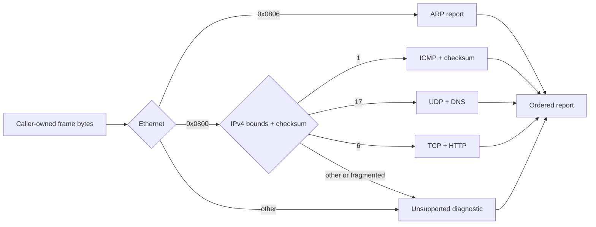

<!-- COURSE_COMPONENT:diagnostics-integration-hero START -->
# Lesson 12: Diagnostics integration
<!-- COURSE_COMPONENT:diagnostics-integration-hero END -->
<!-- COURSE_COMPONENT:diagnostics-integration-prerequisites-outcomes START -->
## Learning objectives

By the end of this lesson, you can combine link-, network-, transport-, and application-layer parsing into one bounded diagnostic pipeline. You will preserve layer order, distinguish structural failure from an unsupported protocol, validate Internet checksums, and produce a deterministic summary without allocating memory. The emphasis is integration: each decoder must consume only the byte range established by its parent protocol.

## Prerequisites

This lesson builds on the byte readers, Ethernet and ARP parsing, IPv4 validation, checksum arithmetic, UDP and DNS parsing, TCP interpretation, and HTTP recognition introduced in lessons 2, 3, 5, 6, 9, and 10. Familiarity with `size_t`, fixed-width integers, bit masks, and caller-owned output buffers is expected.
<!-- COURSE_COMPONENT:diagnostics-integration-prerequisites-outcomes END -->

## Mental model

Treat diagnosis as a narrowing window, not as a cast from bytes to structs. Ethernet establishes an EtherType and payload window. IPv4 establishes its header length and total-length window. UDP or TCP then establishes the application payload. Every transition first proves that its next header fits.



The status describes whether the requested operation completed structurally. Diagnostic bits describe observations that may coexist. For example, a complete HTTP frame with a bad TCP checksum still returns `TCPIP_L12_OK` while setting `TCPIP_L12_DIAG_CHECKSUM_MISMATCH`.

## Wire format or API

The public API is deliberately small:

```c
tcpip_l12_report report;
tcpip_l12_status status =
    tcpip_l12_diagnose_frame(frame, frame_length, &report);

char summary[512];
size_t required = 0;
tcpip_l12_status format_status =
    tcpip_l12_format_report(&report, summary, sizeof(summary), &required);
```

The report exposes an ordered `layers` array, a diagnostic bit mask, frame/parsed/payload lengths, selected protocol fields, and checksum totals. `tcpip_l12_format_report` sets `required` to the number of characters excluding the terminating NUL. If capacity is insufficient, it returns `TCPIP_L12_CAPACITY` and writes a terminated prefix whenever capacity is nonzero.

| Observation | Function status | Diagnostic bit |
|---|---:|---:|
| Complete supported frame | `TCPIP_L12_OK` | none |
| Complete unknown protocol | `TCPIP_L12_OK` | `UNSUPPORTED` |
| Missing required bytes | `TCPIP_L12_TRUNCATED` | `TRUNCATED` |
| Impossible header value | `TCPIP_L12_MALFORMED` | `MALFORMED` |
| Complete frame, bad checksum | `TCPIP_L12_OK` | `CHECKSUM_MISMATCH` |

**What to notice:** a report remains useful on failure. Its ordered path shows how far parsing progressed, and `parsed_length` identifies the boundary reached without claiming that missing bytes existed.

## Algorithm and state transitions

1. Validate pointers and clear the caller-owned report.
2. Record Ethernet, require 14 bytes, and decode EtherType with shifts.
3. For ARP, derive the complete size from hardware and protocol address lengths before reading addresses.
4. For IPv4, validate version, IHL, total length, and header checksum. Reject impossible lengths; report missing bytes as truncation.
5. Reject fragment reassembly as unsupported, because upper-layer bytes may not be present in one frame.
6. Dispatch protocol 1 to ICMP, 17 to UDP, and 6 to TCP.
7. Validate transport lengths and checksums over exactly the parent-defined payload.
8. Recognize DNS on port 53 and HTTP on ports 80 or 8080, then append the application layer only in wire order.
9. Format the accumulated result into a stable, single-line representation.

DNS question names are walked label by label. Compression pointers are range-checked, but this diagnostic parser does not recursively follow them because it only needs to establish safe structure. HTTP recognition requires a known request or response prefix and a complete CRLF-terminated header block.

## Worked C example

A caller can inspect both the return status and diagnostics:

```c
tcpip_l12_report report;
tcpip_l12_status status = tcpip_l12_diagnose_frame(bytes, length, &report);

if (status == TCPIP_L12_TRUNCATED) {
  /* report.layers and report.parsed_length still explain the partial frame. */
}
if ((report.diagnostics & TCPIP_L12_DIAG_CHECKSUM_MISMATCH) != 0U) {
  /* Preserve the decoded summary, but do not trust payload integrity. */
}
```

No packed structure, unaligned cast, or host-endian assumption appears here. The implementation reads multibyte values explicitly in network byte order.

<!-- COURSE_COMPONENT:diagnostics-integration-exercise-test START -->
## Exercise

Complete `exercise.c` so that it matches the contract in `lesson.h`. Start with Ethernet and ARP, then add the IPv4 length window before implementing ICMP, UDP/DNS, and TCP/HTTP. Keep checksum failure orthogonal to structural parsing. Finally, implement formatting with queryable capacity: `(out == NULL, cap == 0)` is a valid size query and returns `TCPIP_L12_CAPACITY` for a nonempty report.

The starter intentionally validates arguments, initializes outputs, and returns `TCPIP_L12_TODO`. A correct implementation makes the same deterministic tests pass when `TCPIP_USE_SOLUTIONS` is disabled.

## Test contract and invariants

The test suite constructs bytes locally rather than loading captures. It verifies Ethernet→ARP, Ethernet→IPv4→ICMP, Ethernet→IPv4→UDP→DNS, and Ethernet→IPv4→TCP→HTTP paths. Checksums are computed for fixture construction, then one HTTP payload byte is flipped; the expected result stays structurally successful but exposes exactly one invalid checksum. Additional cases require truncation and malformed diagnostics, an unsupported EtherType, exact summary text, and NUL termination for a short output buffer.

Important invariants are: `layer_count <= TCPIP_L12_MAX_LAYERS`; layers are appended only in outer-to-inner order; every read lies within the current protocol window; `checksums_valid <= checksums_checked`; and no diagnostic bit silently changes the meaning of the status code.
<!-- COURSE_COMPONENT:diagnostics-integration-exercise-test END -->

## Common mistakes

Do not cast `data` to an Ethernet, IPv4, UDP, or TCP struct. That risks alignment, padding, aliasing, and byte-order errors. Do not use the captured frame length as the UDP or TCP length after IPv4 has declared a shorter total length. Do not treat UDP checksum zero as a mismatch for IPv4, because zero means the sender omitted that checksum. Do not overwrite an earlier diagnostic when adding another bit. Do not append DNS or HTTP merely because bytes resemble text; first establish the relevant transport port and bounded payload.

<!-- COURSE_COMPONENT:diagnostics-integration-safety START -->
## Safety and network boundaries

All fixtures are deterministic arrays created in the test process. The code performs no allocation, uses no mutable global state, opens no sockets, and makes no system calls for networking. External network access, raw packet capture, elevated privilege, and privileged interfaces are prohibited for this lesson. Fuzzing, if added, must call the same in-memory API with bounded byte arrays.

An explicit non-goal is production-grade packet inspection. The implementation does not reassemble IPv4 fragments or TCP streams, decrypt TLS, normalize every HTTP variation, recursively resolve arbitrary DNS compression graphs, or verify that Ethernet padding belongs to an upper-layer message. Those features require state and policy beyond a single-frame lesson.
<!-- COURSE_COMPONENT:diagnostics-integration-safety END -->

## Linux implementation connection

The optional [Kernel Source Walkthrough lab](../../linux_labs/04_kernel_source_walkthrough/README.md) compares this report pipeline with Linux's internal ingress and egress paths while keeping all navigation metadata offline. [`include/uapi/linux/inet_diag.h`](https://github.com/torvalds/linux/blob/v6.6/include/uapi/linux/inet_diag.h) is pinned v6.6 UAPI intended for user/kernel communication. [`net/ipv4/inet_diag.c`](https://github.com/torvalds/linux/blob/v6.6/net/ipv4/inet_diag.c) is internal implementation source, not an application API or a source snapshot to vendor. The distinction keeps the lab authored, unprivileged, and free of packet capture while still showing how Linux narrows and reports networking state.

## Further experiments

Add a fixture with IPv4 options and prove that transport parsing begins at the IHL-derived boundary. Try a UDP packet with checksum zero and compare its checksum counters. Generate every truncation prefix of a valid DNS frame and assert that sanitizers remain silent. Extend formatting with symbolic diagnostic names while preserving size-query behavior. Finally, consider a caller-provided policy that can choose whether checksum mismatches are warnings or fatal errors without changing the parser.

## Summary

A safe diagnostic integrator repeatedly narrows a byte window, records progress before descending, and keeps structural status distinct from observational diagnostics. The resulting report is useful for complete, unsupported, corrupted, and truncated input alike. Explicit byte reads, parent-defined lengths, deterministic formatting, and caller-owned storage make the API portable C17 and suitable for integration tests without introducing network or privilege requirements.
