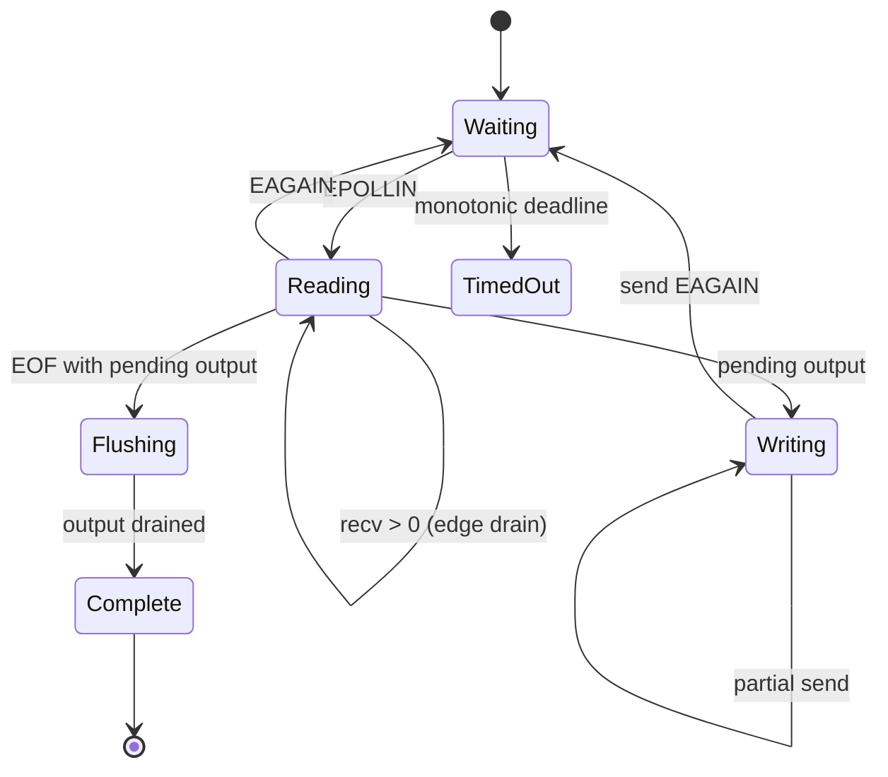

<!-- COURSE_COMPONENT:epoll-hero START -->
# Linux Lab 01: A Correct `epoll` Echo Loop

This optional lab turns the stream-socket ideas from the core course into a small, production-shaped Linux event loop. The task sounds simple: receive a known number of bytes and send the same bytes back. The interesting part is not copying bytes. It is preserving application state while readiness notifications, partial system calls, peer shutdown, signals, and a deadline all compete to change what the program may do next. The reference implementation owns one `epoll` instance for the duration of the call, never allocates memory, and leaves the caller's descriptor flags exactly as it found them.

[Review the public contract](#public-contract) · [Run the Linux labs](https://github.com/lhmily/tcp-ip-course/blob/main/linux_labs/README.md#prerequisites-and-workflow)
<!-- COURSE_COMPONENT:epoll-hero END -->

<!-- COURSE_COMPONENT:epoll-prerequisites START -->
## Prerequisites and learning goals

Complete the stream-socket and TCP reliability lessons first. You should understand that TCP and `SOCK_STREAM` do not preserve message boundaries, that a successful `send` can consume fewer bytes than requested, and that readiness is a hint rather than a promise. Build this lab only on Linux by enabling `TCPIP_BUILD_LINUX_LABS`. No root privileges, network namespace, Internet access, or external service is required; the tests use local Unix `socketpair` endpoints.

After the lab, you should be able to explain why edge-triggered code must drain an operation to `EAGAIN`, why a level-triggered handler benefits from a bounded work quantum, and why unread input and unsent output are different pieces of state.
<!-- COURSE_COMPONENT:epoll-prerequisites END -->



## Public contract

`tcpip_linux_l01_set_nonblocking(fd)` sets `O_NONBLOCK` while retaining every other file status flag. `tcpip_linux_l01_echo(fd, trigger, expected_bytes, timeout_ms, stats)` temporarily makes the endpoint nonblocking, creates and closes its own epoll descriptor, and restores the original flags before returning. `expected_bytes` is the success boundary: the function stops accepting input after that count and succeeds only after the same count has been written back. Early clean shutdown is `EOF` if no data arrived and `TRUNCATED` after a partial stream. The absolute deadline is computed from `CLOCK_MONOTONIC`; retrying after `EINTR` never resets it.

| Course operation | Linux API | Important condition |
|---|---|---|
| register readiness | `epoll_create1`, `epoll_ctl` | include `EPOLLET` only in edge mode |
| await progress | `epoll_wait` | recompute remaining time from one absolute deadline |
| receive stream bytes | `recv` | retain partial bytes; drain edge mode to `EAGAIN` |
| transmit pending bytes | `send(..., MSG_NOSIGNAL)` | advance only by the returned count |
| inspect asynchronous failure | `getsockopt(SO_ERROR)` | handle `EPOLLERR` without guessing |
| preserve caller state | `fcntl(F_GETFL/F_SETFL)` | restore the exact original flags |

The statistics are deliberately observable. `readiness_events` counts returned epoll events; read and write call counters include calls that return `EAGAIN`; byte counters count successful transfers; `read_eagain` and `write_eagain` show completed nonblocking drains; and `drain_passes` exposes edge-triggered handler work. These values teach behavior, but callers should not assume an exact call count because kernel buffer sizing and scheduling vary.

<!-- COURSE_COMPONENT:epoll-contract START -->
## Exercise

Implement `exercise.c` without changing `lab.h` or the tests. Validate all arguments and initialize the entire statistics object before any early return. Use a fixed local buffer and indices for pending output: no heap allocation and no global state. Register `EPOLLIN` and peer-close notifications, adding `EPOLLOUT` only while bytes are pending. A read must not overwrite unsent data. Compaction with `memmove` is acceptable when the free region wraps up against the end of the fixed buffer.

For edge triggering, continue each applicable read or write operation until it produces `EAGAIN`, reaches EOF, fills or empties the local buffer, or reaches the requested byte boundary. For level triggering, perform a bounded amount of work before returning to `epoll_wait`; otherwise one busy connection can monopolize a larger event loop. Treat `EINTR` as a retry of the interrupted operation. Do not turn an elapsed timeout into a fresh timeout after a signal.

A minimal call site looks like this:

```c
tcpip_linux_l01_stats stats;
tcpip_linux_l01_status status = tcpip_linux_l01_echo(
    connected_fd,
    TCPIP_LINUX_L01_TRIGGER_EDGE,
    64U * 1024U,
    2000,
    &stats);
if (status == TCPIP_LINUX_L01_OK) {
  /* stats.bytes_read == stats.bytes_written == 64 KiB */
}
```

## Tests and expected behavior

The test program creates a peer thread for each trigger mode. It reduces socket buffers, moves a payload much larger than those buffers, and deliberately uses small, mismatched peer read/write quanta. This forces partial input and output without relying on sleeps. It verifies content, counts, flag restoration, edge drains, and that the temporary epoll descriptor does not leak. Separate cases cover zero-length work, already-nonblocking descriptors, invalid descriptors, invalid trigger values, null output, negative timeout, clean EOF, EOF after a partial request, and a bounded timeout. CTest adds a hard outer timeout so a broken loop cannot hang the suite indefinitely.
<!-- COURSE_COMPONENT:epoll-contract END -->

<!-- COURSE_COMPONENT:epoll-safety START -->
## Safety notes and non-goals

The implementation suppresses `SIGPIPE` with `MSG_NOSIGNAL`; it does not modify process signal disposition. It does not close the caller's socket. This is a one-connection teaching loop, not a server framework: it has no accept loop, connection table, fairness across descriptors, cancellation API, TLS, framing protocol, or backpressure policy beyond the fixed local buffer. It does not promise to echo bytes after the requested boundary, and it does not diagnose whether a peer's bytes form application messages. Those concerns belong in a protocol layer above this transport exercise.
<!-- COURSE_COMPONENT:epoll-safety END -->
