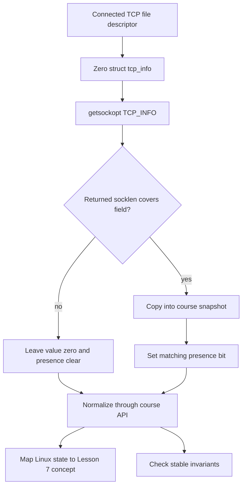

<!-- COURSE_COMPONENT:tcp-info-hero START -->
# Linux Lab 02: Reading `TCP_INFO` Safely

Linux exposes a live TCP control-block summary through `getsockopt(..., TCP_INFO, ...)`. It is tempting to print the kernel's `struct tcp_info` directly and call the result an API. This lab takes the safer route: it defines a course-owned snapshot with fixed-width fields and explicit presence bits, captures only a small set of stable observations, maps Linux states into the reduced state vocabulary used by Lesson 7, and checks invariants without depending on volatile performance values. The result is useful as a diagnostic boundary and as an example of consuming a versioned kernel structure defensively.

[Review the snapshot contract](#snapshot-and-api-contract) · [Run the Linux labs](https://github.com/lhmily/tcp-ip-course/blob/main/linux_labs/README.md#prerequisites-and-workflow)
<!-- COURSE_COMPONENT:tcp-info-hero END -->

<!-- COURSE_COMPONENT:tcp-info-prerequisites START -->
## Prerequisites and learning goals

Review Lesson 7's state model and the stream-socket lesson. You should know the roles of MSS, unacknowledged segments, loss, retransmission, smoothed round-trip time, RTT variation, and congestion-control state. This optional lab requires Linux headers and a Linux kernel implementing `TCP_INFO`. It needs no elevated capabilities, packet capture, external network access, fixed port, or timing tool. Tests create an IPv4 listener on `127.0.0.1:0`, allowing the kernel to select an unused ephemeral port.

The main lesson is ABI hygiene. A program asks for a buffer of one size, but the kernel reports how many bytes it actually returned. Every copied field therefore needs both an offset and a size check. Zeroing the kernel structure first ensures that padding and unavailable tail fields never leak indeterminate bytes into program logic.
<!-- COURSE_COMPONENT:tcp-info-prerequisites END -->



<!-- COURSE_COMPONENT:tcp-info-uapi-view START -->
## Snapshot and API contract

`tcpip_linux_l02_capture(fd, snapshot)` initializes the complete output before validation or system calls. On success it copies only these fields: `state`, `ca_state`, `retransmits`, `snd_mss`, `rcv_mss`, `unacked`, `lost`, `rtt_us`, `rttvar_us`, and `total_retrans`. A corresponding `TCPIP_LINUX_L02_HAS_*` bit says whether the returned length covered that kernel member. Callers must test the bit before interpreting the value; zero by itself can be a real observation or merely the initialized representation of an absent field.

| Course field | Linux member | Interpretation |
|---|---|---|
| `state` | `tcpi_state` | Linux TCP finite-state-machine value |
| `ca_state` | `tcpi_ca_state` | congestion-control recovery state |
| `retransmits` | `tcpi_retransmits` | current RTO retry count |
| `snd_mss`, `rcv_mss` | `tcpi_snd_mss`, `tcpi_rcv_mss` | current send and receive MSS |
| `unacked`, `lost` | `tcpi_unacked`, `tcpi_lost` | segment accounting observations |
| `rtt_us`, `rttvar_us` | `tcpi_rtt`, `tcpi_rttvar` | microsecond estimators |
| `total_retrans` | `tcpi_total_retrans` | lifetime retransmission counter |
<!-- COURSE_COMPONENT:tcp-info-uapi-view END -->

<!-- COURSE_COMPONENT:tcp-info-state-map START -->
`tcpip_linux_l02_map_state` maps `TCP_ESTABLISHED`, handshake states, close states, `TCP_LISTEN`, and `TCP_CLOSE` to the smaller Lesson 7 model. Linux's `TCP_CLOSING` is folded into the active-close concept and `TCP_NEW_SYN_RECV` into SYN-received because the course model intentionally omits those implementation details. Unknown numeric values return `UNSUPPORTED`, and the output is still initialized to `MODEL_CLOSED`.

`tcpip_linux_l02_check_invariants` reports a bit set and a count. It detects a missing or unknown state, present-but-zero MSS or RTT fields, loss with no observable retransmission count, and unknown presence bits. It does not reject absent optional tail fields. The function's status reports whether checking itself was valid; invariant failures are data in the output rather than a system error.
<!-- COURSE_COMPONENT:tcp-info-state-map END -->

<!-- COURSE_COMPONENT:tcp-info-contract START -->
## Exercise

Implement the starter in `exercise.c`. Keep the public representation independent of `struct tcp_info`; users of `lab.h` should not need a kernel header. Before `getsockopt`, zero the kernel object and initialize `socklen_t` to its complete size. Afterward, use a condition equivalent to:

```c
if ((size_t)returned_length >=
    offsetof(struct tcp_info, tcpi_rtt) + sizeof(info.tcpi_rtt)) {
  snapshot->rtt_us = info.tcpi_rtt;
  snapshot->present |= TCPIP_LINUX_L02_HAS_RTT_US;
}
```

Repeat that rule for every field instead of assuming that one successful call returned the newest header layout. Reject a non-TCP or Unix-domain socket cleanly as `UNSUPPORTED`; preserve `SYSTEM` for unexpected operating-system failures. Do not retain pointers to the kernel structure, allocate memory, or introduce global state.

A consumer can remain compatible with shorter returned structures:

```c
tcpip_linux_l02_snapshot snapshot;
if (tcpip_linux_l02_capture(fd, &snapshot) == TCPIP_LINUX_L02_OK &&
    (snapshot.present & TCPIP_LINUX_L02_HAS_RTT_US) != 0U) {
  use_optional_rtt_sample(snapshot.rtt_us);
}
```

## Tests and stable assertions

The tests bind an IPv4 listening socket to loopback port zero, connect a client, accept a server endpoint, and transfer data. They capture both connected endpoints and assert only stable facts: the state maps to established, required early fields are present, negotiated MSS values are nonzero, an RTT estimate is available and nonzero, and invariant checking reports no violations. A listener snapshot separately exercises state mapping. The suite does not expect an exact RTT, RTT variance, congestion window, number of unacknowledged segments, retransmission count, or scheduling interval.

Additional cases verify every public output is initialized on invalid arguments, unknown states are deterministic, a Unix `socketpair` is rejected, and synthetic snapshots produce the documented violation bits. All traffic remains inside the host; no DNS, firewall changes, privileged ports, or remote peer is involved.
<!-- COURSE_COMPONENT:tcp-info-contract END -->

<!-- COURSE_COMPONENT:tcp-info-safety START -->
## Safety notes and non-goals

A snapshot is observational and immediately stale. It is not a synchronization mechanism, congestion-control interface, or promise about the next packet. Field values and structure growth remain Linux concerns, which is why this lab copies into a narrow course-owned representation. The lab does not parse `/proc`, invoke `ss`, expose unstable or very new kernel fields, infer application health, benchmark loopback, or compare endpoints for exact equality. In particular, low loopback RTTs and transient queue counters differ across kernels and machines; treating exact values as tests would teach the wrong contract.
<!-- COURSE_COMPONENT:tcp-info-safety END -->
