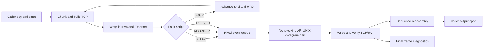

# Linux Lab 03: A deterministic userspace mini-stack

This optional Linux lab ties several earlier lessons into one deliberately small experiment. You will send TCP payload chunks through an IPv4 frame, choose a route, inject bounded faults, reassemble bytes, and inspect the final Ethernet frame. The implementation uses a real Linux `AF_UNIX` `SOCK_DGRAM` socket pair only as the simulated wire. Everything that normally makes a network experiment flaky—wall-clock time, scheduler timing, sleeping, background threads, heap allocation, and global mutable state—is excluded. The result is a repeatable model that still crosses useful operating-system and protocol boundaries.

The single public operation is `tcpip_linux_l03_run(scenario, result)`. A scenario borrows caller-owned input and output spans. It also supplies a route table, addresses and ports, initial sequence numbers, an initial retransmission timeout, an attempt bound, and a finite list of fault actions. A result records the selected route, virtual elapsed time, attempt and retransmission counts, conceptual TCP state, reassembled length, and diagnostics for the last frame that actually crossed the socket pair. No returned pointer outlives the call, and the implementation performs no dynamic allocation.

## Data flow and virtual time



Every transmission attempt has a virtual deadline. `DELIVER` schedules a frame immediately. `DROP` schedules nothing. `DELAY` uses the action's explicit millisecond offset. `REORDER` postpones a chunk by half the current RTO, allowing later chunks to arrive first. The fixed-capacity queue orders events by virtual due time and then insertion order. When no useful event remains before the deadline, the clock jumps directly to that deadline and the RTO doubles for the next attempt. There is no `sleep`, polling loop, or dependence on when Linux schedules the process. A delayed original and a retransmission can both arrive, which provides a deterministic duplicate test: the reassembler must accept matching bytes without counting them twice.

The route table follows Lesson 11 semantics: longest prefix wins, then lower metric, then earlier table position. The solution calls that lesson's reference target rather than maintaining a second routing implementation. It likewise reuses Lesson 03 for IPv4 parsing, Lesson 06 for TCP construction and checksum validation, Lesson 07 for state transitions and reassembly, and Lesson 12 for complete-frame diagnostics. The includes are explicit relative paths because several course units intentionally use the same filename, `lesson.h`; relying on include-directory order would make the lab ambiguous.

## Contract at a glance

| Input or result | Rule | Why it matters |
|---|---|---|
| `payload` / `payload_length` | Borrowed, nonempty, at most 1024 bytes | Keeps frame and queue storage bounded |
| `output` / `output_capacity` | Caller-owned and large enough for all payload bytes | Avoids allocation and partial success |
| `routes` | Canonical Lesson 11 routes | Makes route choice inspectable |
| `initial_rto_ms` | Nonzero virtual duration | Guarantees progress without real time |
| `max_attempts` | Nonzero finite bound | Prevents an infinite retry exercise |
| `faults` | At most 32 authored actions | Makes failure behavior deterministic |
| `final_frame_diagnostic` | Formatted Lesson 12 report | Proves the delivered bytes formed a valid frame |

A minimal caller can use a default route and no faults:

```c
uint8_t output[5];
const uint8_t payload[] = "hello";
tcpip_l11_route route = {{0, 0, 0, 0}, 0, {0, 0, 0, 0}, 1, 100};
tcpip_linux_l03_scenario scenario = {
    .payload = payload, .payload_length = 5,
    .output = output, .output_capacity = sizeof(output),
    .routes = &route, .route_count = 1,
    .source_ipv4 = {192, 0, 2, 10},
    .destination_ipv4 = {198, 51, 100, 7},
    .source_port = 40000, .destination_port = 443,
    .sender_initial_seq = 1000, .receiver_initial_seq = 9000,
    .initial_rto_ms = 100, .max_attempts = 3
};
tcpip_linux_l03_result result;
tcpip_linux_l03_status status = tcpip_linux_l03_run(&scenario, &result);
```

## Exercise workflow

Start with `exercise.c`. It already clears the result, establishes failure sentinels, and validates the main scalar and span contracts. The `TCPIP_LINUX_L03_TODO` return is intentional. Implement the scenario without changing `lab.h`, then compare behavior with the solution build. Useful milestones are route selection; transition from closed through active open to established; fixed-size chunk construction; fault-to-event translation; nonblocking datagram transfer; parser and checksum verification; reassembly; timeout backoff; and final diagnostics. Preserve transactional behavior where practical: validation failures must not write payload output, and the result should remain predictably initialized.

The test program covers a clean delivery, a first-attempt drop followed by retransmission, out-of-order chunks, a delayed duplicate, retry exhaustion, longest-prefix route selection, insufficient output capacity, deterministic repeated runs, and the mandatory final diagnostic. Configure on Linux with `-DTCPIP_BUILD_LINUX_LABS=ON` and choose `-DTCPIP_USE_SOLUTIONS=ON` for the reference implementation. Sanitizer and warnings-as-errors configurations are strongly recommended.

## Safety, provenance, and non-goals

This is a userspace teaching model, not a network stack suitable for production or hostile input. It does not open an Internet or packet socket, change interfaces, require root, send traffic outside the local process, or mutate kernel state. The socket pair carries complete synthetic Ethernet frames, but Unix datagrams do not model MTUs, NIC queues, congestion, stream semantics, or real packet loss. TCP handshaking and acknowledgments are conceptual; the model focuses on bounded payload reliability and reassembly rather than complete RFC conformance. There is no congestion control, receive-window evolution, fragmentation, IPv6, NAT, TLS, application protocol, persistence, or concurrent endpoint.

The course code is authored for this repository. Its use of Linux APIs is based on their documented userspace interface and does not copy Linux kernel implementation text. Linux itself is licensed under GPL-2.0-only; that license and Linux authorship apply to the kernel, not automatically to independently authored examples that merely call system interfaces. If you inspect or redistribute Linux source while extending this exercise, retain its GPL notices and follow the GPL's requirements. Do not paste kernel code into this lab. The explicit source boundaries keep provenance review straightforward.

Because virtual time is not wall time, `virtual_elapsed_ms` must never be interpreted as a latency benchmark. Likewise, successful diagnostics prove internal frame consistency under this model, not interoperability with a real host. Treat the lab as a bridge between protocol mechanics and Linux I/O primitives: a controlled environment in which every retry, queue slot, sequence offset, and final byte can be explained.
