# Linux Lab 04: Kernel source walkthrough, pinned to v6.6

This optional lab teaches source navigation rather than kernel programming. It presents a small, authored index of symbols and directed edges that explain two representative TCP paths in Linux v6.6: a received IPv4 segment moving from the device receive core toward acknowledgment processing, and application bytes moving from `sendmsg` toward device transmission. A third symbol, `tcp_get_info`, connects internal TCP state to the userspace `TCP_INFO` observation interface. The index stores identifiers, names, concise descriptions, source paths, approximate pinned lines, and generated links. It does not contain copied Linux source.

Pinning matters. Kernel internals evolve continuously: helpers move, names change, callbacks become indirect, and fast paths split. All URLs produced by this lab point to the immutable `v6.6` tag in Linus Torvalds's GitHub mirror. That makes exercises, tests, and classroom discussion reproducible even when the learner's running kernel is newer. The path is an authored reading route, not a claim that every runtime packet produces a simple direct C call chain. Netfilter hooks, BPF, routing cache outcomes, protocol registration, socket state, offloads, queueing disciplines, namespaces, and architecture-specific details can alter real execution.

## The indexed routes

```mermaid
flowchart TB
    subgraph ingress[Ingress reading route]
      RX[netif_receive_skb] --> CORE[__netif_receive_skb_one_core]
      CORE --> IRCV[ip_rcv]
      IRCV --> IRF[ip_rcv_finish]
      IRF --> RIN[ip_route_input_noref]
      RIN --> RIS[ip_route_input_slow]
      RIS --> LD[ip_local_deliver]
      LD --> LDF[ip_local_deliver_finish]
      LDF --> TV4[tcp_v4_rcv]
      TV4 --> LOOK[__inet_lookup_skb]
      LOOK --> EST[__inet_lookup_established]
      EST --> RCV[tcp_rcv_established]
      RCV --> ACK[tcp_ack]
    end
    subgraph egress[Egress reading route]
      SEND[sock_sendmsg] --> TS[tcp_sendmsg]
      TS --> TSL[tcp_sendmsg_locked]
      TSL --> WX[tcp_write_xmit]
      WX --> TX[tcp_transmit_skb]
      TX --> ROUTE[ip_route_output_flow]
      ROUTE --> IQ[ip_queue_xmit]
      IQ --> IIQ[__ip_queue_xmit]
      IIQ --> LO[ip_local_out]
      LO --> OUT[ip_output]
      OUT --> FIN[ip_finish_output]
      FIN --> DEV[__dev_queue_xmit]
    end
    INFO[tcp_get_info] -. observation bridge .-> API[TCP_INFO]
```



The exact ingress sequence is `netif_receive_skb`, `__netif_receive_skb_one_core`, `ip_rcv`, `ip_rcv_finish`, `ip_route_input_noref`, `ip_route_input_slow`, `ip_local_deliver`, `ip_local_deliver_finish`, `tcp_v4_rcv`, `__inet_lookup_skb`, `__inet_lookup_established`, `tcp_rcv_established`, and `tcp_ack`. The exact egress sequence is `sock_sendmsg`, `tcp_sendmsg`, `tcp_sendmsg_locked`, `tcp_write_xmit`, `tcp_transmit_skb`, `ip_route_output_flow`, `ip_queue_xmit`, `__ip_queue_xmit`, `ip_local_out`, `ip_output`, `ip_finish_output`, and `__dev_queue_xmit`. Slash notation in prose such as `tcp_sendmsg/tcp_sendmsg_locked` or `ip_queue_xmit/__ip_queue_xmit` describes neighboring indexed symbols, not an interchangeable alias.

## API and CLI

| Interface | Success behavior | Rejection behavior |
|---|---|---|
| `tcpip_linux_l04_symbol_by_id` | Returns a stable pointer to one authored record | Unknown IDs return `NOT_FOUND` |
| `tcpip_linux_l04_validate_path` | Accepts one symbol or a sequence of authored directed edges | Unknown, reversed, or skipped edges are rejected |
| `tcpip_linux_l04_format_source_url` | Writes a pinned HTTPS URL and required length | Small buffers return `CAPACITY`; unknown IDs return `NOT_FOUND` |
| `tcpip_linux_l04_ingress_path` | Returns the exact ingress ID array | A null count pointer returns null |
| `tcpip_linux_l04_egress_path` | Returns the exact egress ID array | A null count pointer returns null |

The offline CLI is built as `tcpip_linux_l04_cli`. It never fetches a URL. `--list` prints every indexed symbol, `--ingress` and `--egress` print the two reading routes, and a symbol key prints its description and source URL. For example:

```sh
./tcpip_linux_l04_cli --ingress
./tcpip_linux_l04_cli tcp_ack
./tcpip_linux_l04_cli tcp_get_info
```

A C caller can perform the same lookup without parsing CLI text:

```c
const tcpip_linux_l04_symbol *symbol = NULL;
char url[256];
size_t written = 0;
if (tcpip_linux_l04_symbol_by_id(TCPIP_LINUX_L04_TCP_ACK, &symbol) ==
        TCPIP_LINUX_L04_OK &&
    tcpip_linux_l04_format_source_url(symbol->id, url, sizeof(url), &written) ==
        TCPIP_LINUX_L04_OK) {
  /* Display symbol->description and url; no network access occurs here. */
}
```

## How to read a symbol

Open the generated v6.6 URL and first locate the named definition. Read the function signature, then identify its caller or callback registration, its ownership assumptions for `struct sk_buff` or `struct sock`, and the conditions around the next indexed edge. Distinguish a normal direct call from an indirect protocol handler or destination callback. Record what has already been validated: Ethernet protocol dispatch precedes `ip_rcv`; IPv4 routing precedes local delivery; socket lookup precedes established processing. On egress, distinguish copying application data into write queues from selecting a segment, constructing headers, running IP hooks, and entering device queueing.

For the observation bridge, compare fields filled by `tcp_get_info` with the public `struct tcp_info` exposed through `getsockopt(IPPROTO_TCP, TCP_INFO, ...)`. This is a safer and more stable way to observe selected transport state than attaching to internals. Field availability can still depend on headers and kernel versions, so application code must honor the returned option length rather than assuming every recent extension exists.

The starter `exercise.c` establishes output initialization and basic ID, path-span, and URL-buffer validation, then returns `TCPIP_LINUX_L04_TODO`. Implement the static index and authored edge validation without downloading source or adding generated files. Tests require unique IDs, the exact two sequences above, rejection of unknown, reversed, and skipped paths, HTTPS URLs pinned to `/v6.6/`, and the `tcp_get_info` bridge. The solution intentionally keeps data static and immutable so calls require no allocation or global mutation.

## GPL provenance, safety, and non-goals

Linux v6.6 source is copyrighted by its contributors and distributed under GPL-2.0-only, with additional per-file notices where present. The links in this lab lead to that GPL-licensed work. The records and descriptions here are independently authored navigation metadata; no kernel function body, comment block, or vendored source file is included. When reading Linux, consult its top-level `COPYING` file and SPDX identifiers. If you copy, modify, compile, or redistribute kernel code outside this walkthrough, your obligations differ from merely linking to and discussing it. Preserve provenance and seek appropriate review for redistribution questions.

The CLI performs no network access, module loading, tracing, probing, privileged operation, or kernel modification. It does not require root. Opening a printed URL later is a separate user action. This lab is not instructions for deploying a kernel, writing a driver, installing eBPF programs, changing sysctls, bypassing security controls, or debugging a production outage. It makes no guarantee that source line anchors remain semantically ideal within all mirrors, although the pinned tag and path remain immutable. It also does not model every ingress or egress branch, UDP, IPv6, forwarding, raw sockets, XDP, GRO/GSO, hardware offload, retransmission details, or lock ordering.

Most importantly, do not treat the path validator as a kernel call-graph analyzer. It only recognizes edges deliberately authored for this lesson. Rejecting a skipped pair means “not an adjacent teaching edge,” not “these symbols can never be related.” Accepting an edge likewise means “follow this next while reading v6.6,” not that a probe will always observe consecutive stack frames. That narrow contract is a feature: it makes source-study expectations precise, testable, offline, and reviewable without pretending a large configurable kernel has one universal execution trace.
