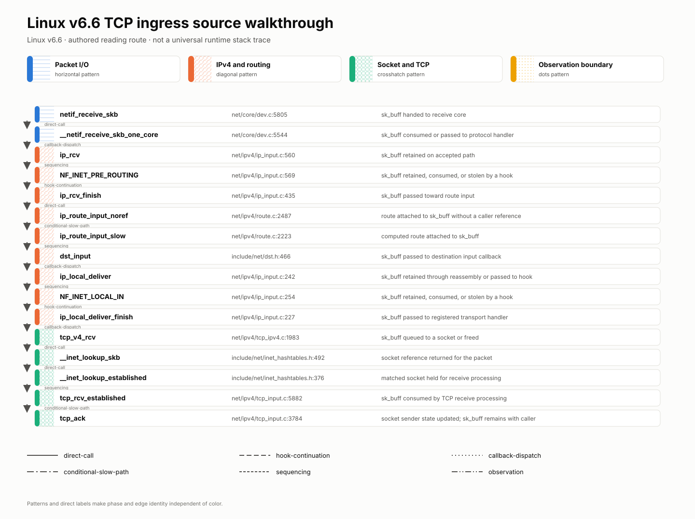
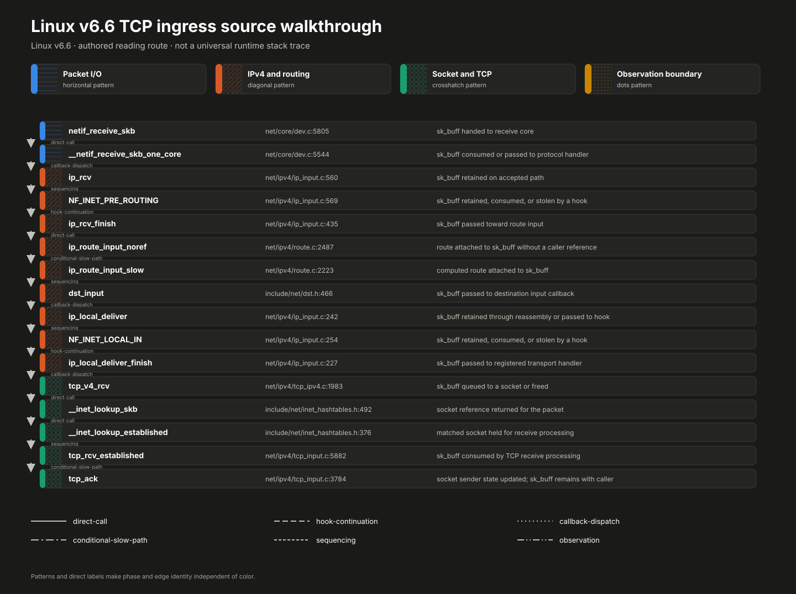
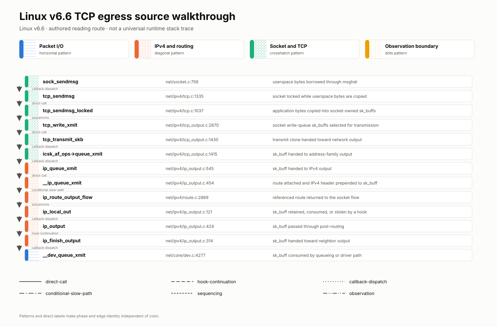
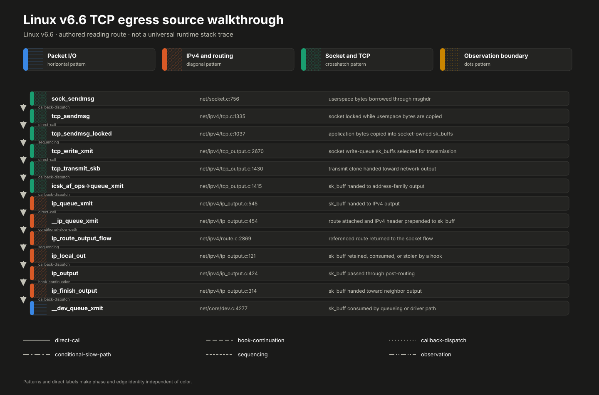
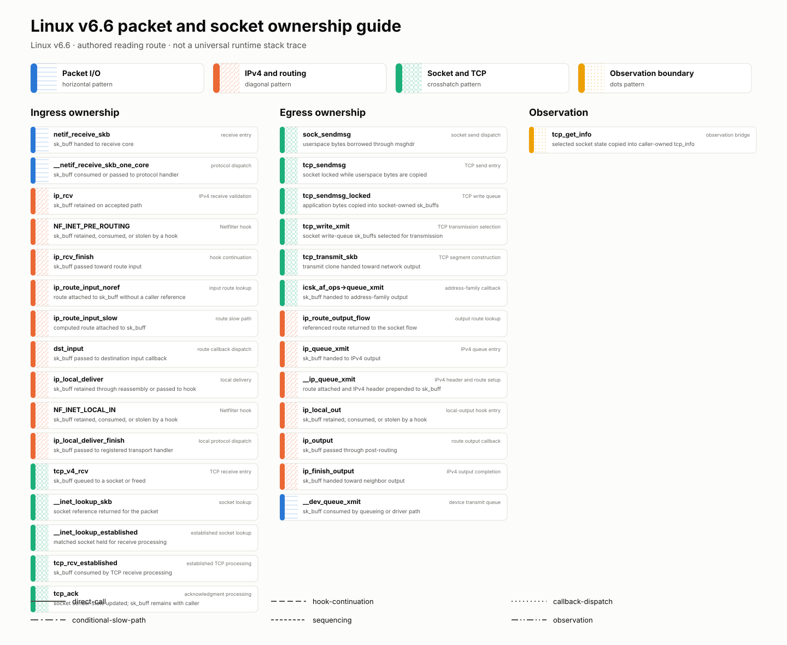
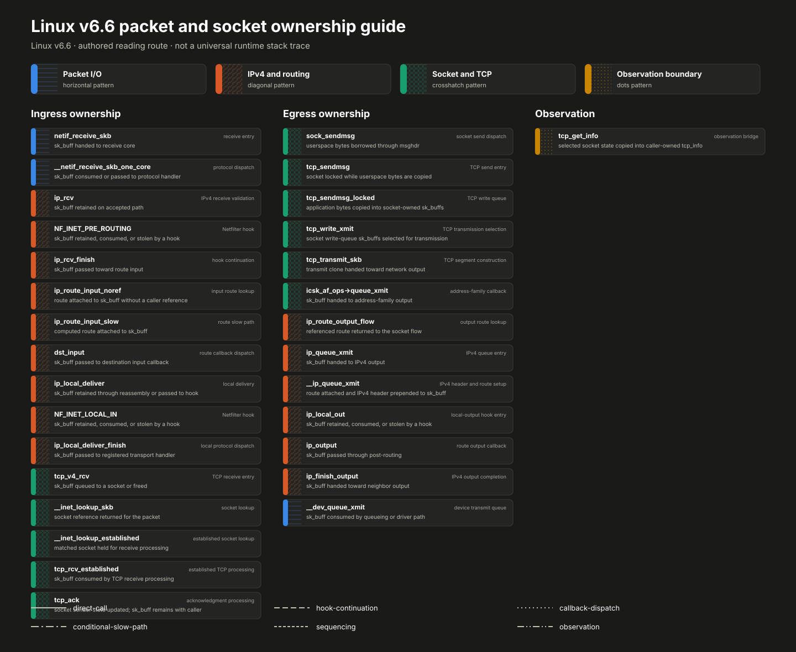
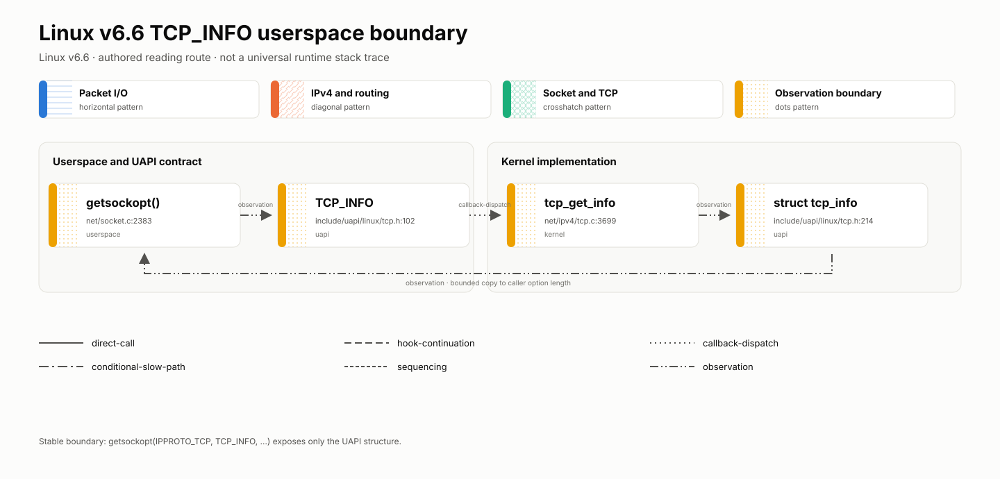
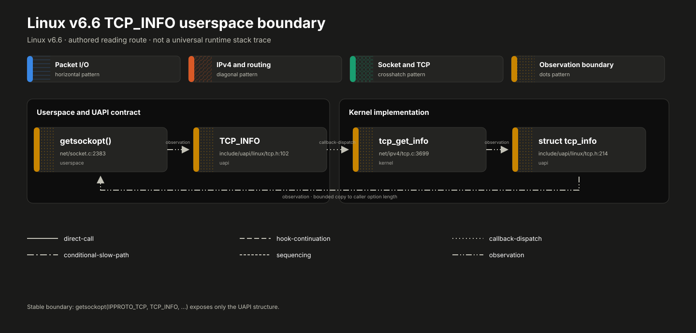

<!-- COURSE_COMPONENT:kernel-walkthrough-hero START -->
# Linux Lab 04: Kernel source walkthrough, pinned to v6.6

```text
packet bytes → receive core → IPv4 policy and routing → socket lookup → TCP state
application bytes → socket layer → TCP write queue → IPv4 output → device queue
```

**What to notice:** the same `sk_buff` abstraction crosses several ownership and dispatch
boundaries, but an authored reading edge is not necessarily the next C stack frame.

This optional lab teaches source navigation rather than kernel programming. Follow two
small, authored reading routes through Linux v6.6: a received IPv4 TCP segment moving
toward acknowledgement processing, and application bytes moving from `sendmsg` toward
device transmission. Then cross the UAPI boundary at `TCP_INFO` to see how selected
internal state becomes safe, versioned userspace data.

The route is a map, not a trace. Kernel configuration, socket state, routing, Netfilter,
BPF, namespaces, offloads, queueing, and architecture details can change real execution.
Every source link is pinned to the immutable Linux `v6.6` tag so the reading exercise
remains reproducible.

[Open the source explorer](#interactive-source-explorer) · [Review the source index](#source-index)
<!-- COURSE_COMPONENT:kernel-walkthrough-hero END -->

<!-- COURSE_COMPONENT:kernel-walkthrough-prerequisites START -->
## Mental model

Read each route as four questions repeated at every stop:

1. **What object arrived?** Usually an `sk_buff`, a socket, or application bytes.
2. **Who owns it now?** Look for transfer, borrowing, queueing, and consumption rules.
3. **What boundary was crossed?** Device, IP, transport, socket, hook, or UAPI.
4. **Why is the next edge valid?** It may be a direct call, callback, continuation, or
   authored conceptual handoff rather than the next C stack frame.

Use those questions to follow ingress to acknowledgement processing, egress to device
queueing, and the `tcp_get_info` observation bridge to `struct tcp_info`.
<!-- COURSE_COMPONENT:kernel-walkthrough-prerequisites END -->

<div class="kernel-walkthrough-legend" aria-label="Walkthrough legend">
  <span><i class="kw-legend-line kw-edge-direct" aria-hidden="true"></i> direct call</span>
  <span><i class="kw-legend-line kw-edge-callback" aria-hidden="true"></i> callback</span>
  <span><i class="kw-legend-line kw-edge-continuation" aria-hidden="true"></i> continuation</span>
  <span><i class="kw-legend-line kw-edge-observation" aria-hidden="true"></i> observation boundary</span>
</div>

Solid, dashed, double, and dotted line patterns carry meaning independently of color.
The explorer repeats every edge type as text for screen readers and high-contrast modes.

## The indexed routes

### Ingress: device receive to TCP acknowledgement

<figure class="kernel-walkthrough-figure kw-route-figure" tabindex="0" aria-label="Scrollable ingress route diagram">
  <picture class="kernel-walkthrough-picture kw-theme-light">
    
  </picture>
  <picture class="kernel-walkthrough-picture kw-theme-dark">
    
  </picture>
  <figcaption>On a narrow screen, scroll sideways to keep source labels readable.</figcaption>
</figure>

Begin with `netif_receive_skb`, cross IPv4 validation and the pre-routing hook, inspect
how input routing installs a destination callback, then follow local delivery into socket
lookup and established TCP processing. `NF_INET_PRE_ROUTING` and `NF_INET_LOCAL_IN` are
virtual teaching nodes anchored at their v6.6 `NF_HOOK` call sites. They make the
continuation boundaries visible; they are not ordinary function definitions.

### Egress: application bytes to device queue

<figure class="kernel-walkthrough-figure kw-route-figure" tabindex="0" aria-label="Scrollable egress route diagram">
  <picture class="kernel-walkthrough-picture kw-theme-light">
    
  </picture>
  <picture class="kernel-walkthrough-picture kw-theme-dark">
    
  </picture>
  <figcaption>On a narrow screen, scroll sideways to keep source labels readable.</figcaption>
</figure>

Start at `sock_sendmsg`, distinguish copying bytes into TCP write queues from selecting a
segment, and pause at `icsk_af_ops->queue_xmit`: this is an indirect address-family
callback. IPv4 output performs or reuses route lookup, passes local-output and
post-routing policy points, and eventually reaches `__dev_queue_xmit`.

Slash notation in prose such as `tcp_sendmsg/tcp_sendmsg_locked` or
`ip_queue_xmit/__ip_queue_xmit` names adjacent indexed symbols, not interchangeable
aliases.

## Interactive source explorer

Use **Ingress** and **Egress** to choose a route. Filter by phase, select any symbol, or
move in route order with **Previous** and **Next**. With focus in the route, use Left and
Right Arrow, Home, or End; Enter and Space activate the focused symbol. Without
JavaScript, both complete routes and all pinned source links remain available below.

<!-- L04_INTERACTIVE_EXPLORER -->

## Phased theory: what changes along the route

### Phase 1: enter with a bounded object

Ingress begins with an `sk_buff` already created by lower receive machinery. Egress
begins with a socket operation and user-provided bytes. Do not infer ownership from a
pointer type alone: read the caller, return convention, queue operation, and nearby
failure paths.

### Phase 2: validate and classify

IPv4 receive validates enough structure to continue, while TCP receive later validates
transport-specific state. On egress, TCP turns stream bytes into queued transport work.
These stages do different jobs even when they touch the same packet buffer.

### Phase 3: route and dispatch

An input or output route is a decision plus callbacks stored on a destination entry.
Protocol and address-family operations add more indirect dispatch. When the explorer
labels an edge “callback,” find where that callback was selected or registered before
assuming a direct textual call.

### Phase 4: apply policy and transfer ownership

Netfilter hooks can accept, alter, queue, redirect, or drop traffic. A continuation runs
only after the hook framework permits it. Near device queueing, successful submission
usually transfers responsibility away from the caller; error paths may consume or free
objects differently. Confirm the exact local contract in pinned source.

## Ownership and the UAPI boundary

<figure class="kernel-walkthrough-figure kw-boundary-figure">
  <picture class="kernel-walkthrough-picture kw-theme-light">
    
  </picture>
  <picture class="kernel-walkthrough-picture kw-theme-dark">
    
  </picture>
</figure>

Treat ownership labels as reading prompts, not a substitute for source. “Borrowed” means
the current code may inspect an object without gaining independent lifetime; “queued”
means another subsystem may now control when work completes; “consumed” means callers
must not assume the object remains usable.

<figure class="kernel-walkthrough-figure kw-boundary-figure">
  <picture class="kernel-walkthrough-picture kw-theme-light">
    
  </picture>
  <picture class="kernel-walkthrough-picture kw-theme-dark">
    
  </picture>
</figure>

`tcp_get_info` is the observation bridge. Compare the internal fields it reads with the
public `struct tcp_info` returned by
`getsockopt(IPPROTO_TCP, TCP_INFO, ...)`. Applications must honor the returned option
length: headers and kernels can expose different trailing fields. Prefer this stable,
unprivileged interface over attaching to internal implementation details when it answers
your question.

## API and CLI

| Interface | Success behavior | Rejection behavior |
|---|---|---|
| `tcpip_linux_l04_symbol_by_id` | Returns a stable pointer to one authored record | Unknown IDs return `NOT_FOUND` |
| `tcpip_linux_l04_validate_path` | Accepts one symbol or a sequence of authored directed edges | Unknown, reversed, or skipped edges are rejected |
| `tcpip_linux_l04_format_source_url` | Writes a pinned HTTPS URL and required length | Zero or small capacity returns `CAPACITY` with the required length and no partial URL; invalid calls initialize available outputs |
| `tcpip_linux_l04_ingress_path` | Returns the exact ingress ID array | A null count pointer returns null |
| `tcpip_linux_l04_egress_path` | Returns the exact egress ID array | A null count pointer returns null |

The offline CLI is built as `tcpip_linux_l04_cli`. It never fetches a URL. The following
commands are copyable from the build directory:

```console
$ ./tcpip_linux_l04_cli --ingress
netif_receive_skb
__netif_receive_skb_one_core
ip_rcv
...
tcp_rcv_established
tcp_ack

$ ./tcpip_linux_l04_cli tcp_ack
tcp_ack: Apply an acknowledgment to TCP sender state.
https://github.com/torvalds/linux/blob/v6.6/net/ipv4/tcp_input.c#L3784

$ ./tcpip_linux_l04_cli tcp_get_info
tcp_get_info: Bridge internal TCP state to the TCP_INFO observation API.
https://github.com/torvalds/linux/blob/v6.6/net/ipv4/tcp.c#L3699
```

`--list` prints every indexed symbol, `--ingress` and `--egress` print the two routes, and
a symbol key prints its description and source URL. Unknown options, unknown keys, and
extra arguments are usage errors that exit nonzero.

A C caller can perform the same lookup without parsing CLI text:

```c
const tcpip_linux_l04_symbol *symbol = NULL;
char url[256];
size_t written = 0;
if (tcpip_linux_l04_symbol_by_id(TCPIP_LINUX_L04_TCP_ACK, &symbol) ==
        TCPIP_LINUX_L04_OK &&
    tcpip_linux_l04_format_source_url(symbol->id, url, sizeof(url), &written) ==
        TCPIP_LINUX_L04_OK) {
  /* Display symbol->description and url; no network access occurs here. */
}
```

## How to read a symbol

1. Open the generated v6.6 link and locate the named definition or anchored call site.
2. Read the signature and return contract before reading the body.
3. Identify the object in motion and write down its ownership at entry and exit.
4. Classify the next edge: direct call, callback, continuation, or observation boundary.
5. Read the conditions around that edge and one representative failure path.
6. Return to the route; do not expand into every helper on the first pass.

## Source index

The generated site expands this marker into all 30 authored records. Each source link is
constructed from the validated repository, ref, path, and line in the walkthrough data;
the source README intentionally does not duplicate that generated table.

<!-- L04_SOURCE_TABLE -->

<!-- COURSE_COMPONENT:kernel-walkthrough-contract START -->
## Staged exercise checklist

- [ ] **Orientation:** Explain why this authored route is not a universal runtime call
      graph.
- [ ] **Ingress:** Follow the receive route and identify both Netfilter continuations.
- [ ] **Dispatch:** Find one destination callback and one protocol or socket lookup.
- [ ] **Egress:** Separate write-queue creation, segment selection, header construction,
      route lookup, and device queueing.
- [ ] **Ownership:** Record one borrowed reference, one queue transfer, and one consume or
      free path from pinned source.
- [ ] **UAPI:** Compare `tcp_get_info` with `struct tcp_info` and explain option-length
      handling.
- [ ] **Implementation:** Complete the static C index and directed-edge validator.
- [ ] **Verification:** Run the native tests and exercise reversed, skipped, and unknown
      paths.

The starter `exercise.c` establishes output initialization and basic ID, path-span, and
URL-buffer validation, then returns `TCPIP_LINUX_L04_TODO`. Implement the static index
and authored edge validation without downloading source or adding generated files. Tests
require unique IDs, the exact two sequences, rejection of unknown, reversed, and skipped
paths, HTTPS URLs pinned to `/v6.6/`, no partial writes on capacity queries, CLI usage
errors for unknown options or extra arguments, and the `tcp_get_info` bridge. Keep the
data static and immutable so calls require no allocation or global mutation.
<!-- COURSE_COMPONENT:kernel-walkthrough-contract END -->

<!-- COURSE_COMPONENT:kernel-walkthrough-safety START -->
## GPL provenance, safety, and non-goals

Linux v6.6 source is copyrighted by its contributors and distributed under
GPL-2.0-only, with additional per-file notices where present. The links in this lab lead
to that GPL-licensed work. The records and descriptions here are independently authored
navigation metadata; no kernel function body, comment block, or vendored source file is
included. When reading Linux, consult its top-level `COPYING` file and SPDX identifiers.
Copying, modifying, compiling, or redistributing kernel code creates obligations that
merely linking to and discussing it does not; preserve provenance and seek appropriate
review for redistribution questions.

The CLI performs no network access, module loading, tracing, probing, privileged
operation, or kernel modification. It does not require root. Opening a printed URL is a
separate user action. This lab is not instructions for deploying a kernel, writing a
driver, installing eBPF programs, changing sysctls, bypassing security controls, or
debugging a production outage. Line anchors were verified against the `v6.6` tag in
Linus Torvalds's GitHub mirror, whose peeled tag object is commit
`ffc253263a1375a65fa6c9f62a893e9767fbebfa`.

Non-goals include modeling every ingress or egress branch, UDP, IPv6, forwarding, raw
sockets, XDP, GRO/GSO, hardware offload, retransmission details, or lock ordering. Do not
treat the path validator as a call-graph analyzer. Rejecting a skipped pair means “not an
adjacent teaching edge”; accepting an edge means “follow this next while reading v6.6.”
That narrow contract keeps source-study expectations precise, offline, testable, and
reviewable without pretending a configurable kernel has one universal execution trace.
<!-- COURSE_COMPONENT:kernel-walkthrough-safety END -->
