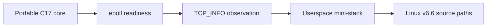

# Optional Linux implementation track

The portable core remains the complete 12-lesson course. These four optional Linux-only labs connect its explicit C17 models to selected Linux networking interfaces and implementation boundaries without turning kernel internals into a prerequisite.



**What to notice:** the track moves from stable Linux user-space interfaces toward kernel internals. The runnable labs remain local and unprivileged; the final walkthrough studies source ownership and call paths without copying or executing kernel code.

## Prerequisites and workflow

Use an Ubuntu or comparable Linux environment with GCC or Clang, CMake 3.25 or newer, CTest, and the system's Linux UAPI headers. No root access, network namespace, virtual interface, packet capture, raw socket, or internet connection is required. Build the starter and reference variants separately:

```sh
cmake --preset linux-student
cmake --build --preset linux-student
ctest --preset linux-student

cmake --preset linux-reference
cmake --build --preset linux-reference
ctest --preset linux-reference
```

Use `linux-sanitize` with Clang for AddressSanitizer and UndefinedBehaviorSanitizer coverage. The tests use deterministic buffers, ordinary unprivileged APIs, and loopback with operating-system-assigned ephemeral ports where a socket is necessary.

## Labs

1. [epoll Event Loop](01_epoll_event_loop/README.md) — readiness, framing, deadlines, and descriptor ownership.
2. [TCP_INFO](02_tcp_info/README.md) — loopback TCP observation through versioned Linux UAPI data.
3. [Userspace Mini-Stack](03_userspace_mini_stack/README.md) — deterministic routing, TCP, IPv4, Ethernet, and diagnostics over a local Unix socket pair.
4. [Kernel Source Walkthrough](04_kernel_source_walkthrough/README.md) — authored ingress and egress reading paths through pinned Linux v6.6 source.

## Source and licensing boundary

Linux is licensed under GPL-2.0-only. The lab commentary links to source in the pinned `torvalds/linux` `v6.6` tree for study and provenance, but this MIT-licensed repository does not copy Linux kernel code, comments, tables, or snapshots. UAPI headers describe user/kernel interfaces available to programs; internal kernel files are implementation references, not stable application APIs. All authored lab code must be original and use only interfaces supplied by the learner's local toolchain.

The source links are intentionally pinned so later kernel changes cannot silently alter the material. Updating the pinned kernel version requires a focused review of every annotation and lab reference.

## Safety boundary

The Linux track is observational and local. It rejects raw and packet sockets, packet-capture tools, process execution, wildcard listeners, TUN/TAP devices, namespace or privilege-changing APIs, `fork`/`clone`, and external numeric endpoints. Do not adapt it to inspect traffic, interfaces, namespaces, or systems you do not own and have explicit permission to test.
